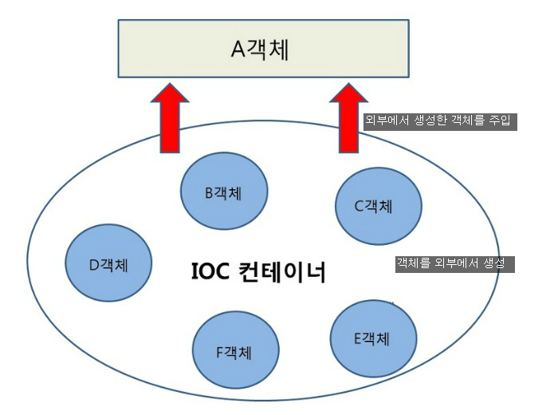
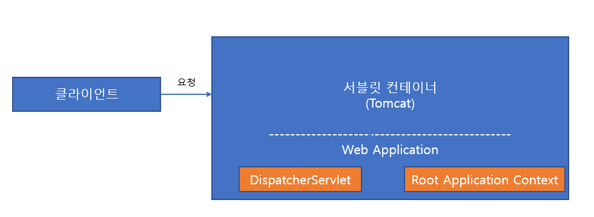
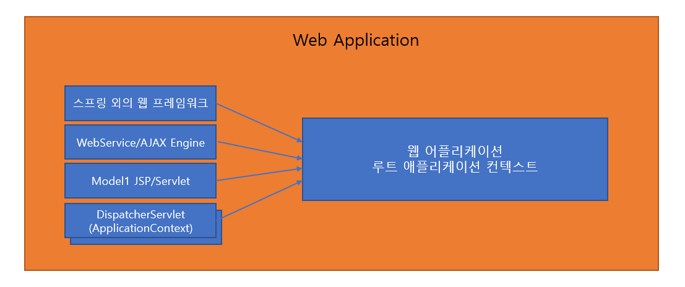
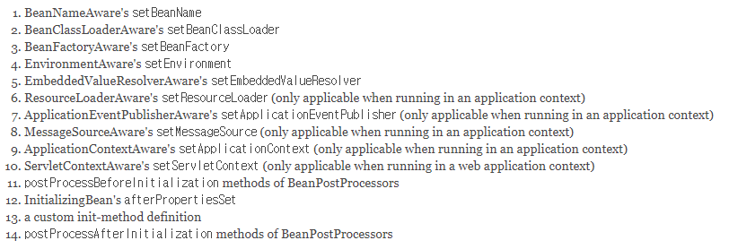
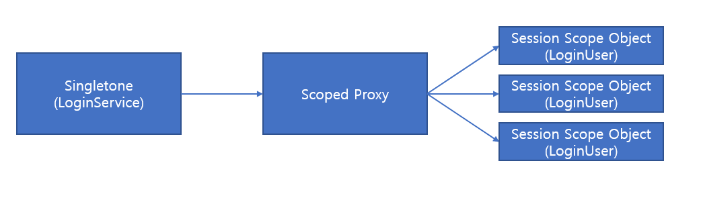

## IoC 컨테이너 : 빈팩토리와 어플리케이션 컨텍스트

- [IoC 컨테이너와 Bean](#ioc-컨테이너와-bean)
- [설정 메타정보](#설정-메타정보)
- [IoC 컨테이너 종류](#ioc-컨테이너의-종류)
- [IoC 컨테이너 계층구조](#ioc-컨테이너-계층구조)
- [빈 설정과 DI](#빈-설정과-di)
- [Autowired](#@Autowired/@Inject를-이용한-di)
- [빈의 스코프](#스코프)
- [프로파일과 프로퍼티](#런타임-환경과-프로파일)
- [IoC 요약](#ioc-요약)

### IoC 컨테이너와 Bean



Spring에서 사용되는 `IoC`란 객체가 내부적으로 조작할 객체를 직접 생성하지 않고 외부로부터 주입받는 기법을 의미한다. 이때 객체를 외부로부터 주입해주는 작업을 DI(의존성 주입)이라고 부른다.

`IoC Container`는 오브젝트의 생성과 관계설정, 사용, 제거 등의 작업을 대신 해준다하여 붙여진 이름이다. 이때, `IoC Container`에 의해 관리되는 오브젝트들은 `Bean` 이라고 부른다. `IoC Container`는 `Bean`을 저장한다고 하여, `BeanFactory` 라고도 불린다. `BeanFactory`는 하나의 인터페이스이며, `Application Context`는 `BeanFactory`의 구현체를 상속받고 있는 인터페이스이다. 실제로 스프링에서 `IoC Container` 라고 불리는 것은 `Application Context`의 구현체이다.

<hr>

### 설정 메타정보


IoC 컨테이너가 관리하는 Bean으로 등록하기 위해서는 적절한 메타정보를 만들어 제공해야 한다. 스프링의 설정메타 정보는 `BeanDefinition` 이라는 인터페이스이다. Xml, 애노테이션, 자바 코드, 프로퍼티 파일 전부 상관없이 `BeanDefinitionReader` 라는 인터페이스에 의해 `BeanDefinition` 객체로 변환된다. Spring IoC는 이러한 설정 메타정보를 통해 오브젝트를 생성하고 DI 작업을 수행한다.

### IoC 컨테이너의 종류

#### StaticApplicationContext

StaticApplicationContext는 코드를 통해 빈 메타정보를 등록하기 위해 사용한다. 스프링의 기능에 대한 학습 테스트를 만들 때를 제외하면 실제로 사용되지 않는다. 웹 관련 기능을 공부하며 학습 테스트로 검증하고 싶을 때는 `StaticWebApplicationContext`를 사용한다.

#### GenericApplicationContext

실전에서 사용될 수 있는 모든 기능을 갖추고 있는 애플리케이션 컨텍스트이다. `StaticApplicationContext`와 달리 XML 파일과 같은 외부의 리소스에 있는 빈 설정 메타정보를 리더를 통해 읽어들여서 메타정보로 전환하여 사용한다.

#### GenericXmlApplicationContext

`GenericApplicationContext`에서 `XmlBeanDefinitionReader`를 내장하고 있어, Xml을 읽어 사용할 때 편리하다.

#### WebApplicationContext

스프링 애플리케이션에서 가장 많이 사용된다. Xml 설정 파일을 사용하는 경우에는 `XmlWebApplicationContext`를 사용하며, 애노테이션을 사용한다면 `AnnotationConfigWebApplicationContext`를 사용한다.



웹 환경에서의 스프링은 클라이언트의 요청을 전부 받는 `FrontController`, `DispatcherServlet`을 제공한다. `DispatcherServlet`는 자체적으로 ApplicationContext를 생성하고, Root Application Context를 부모로 등록한다.

<hr>

### IoC 컨테이너 계층구조

IoC 컨테이너는 계층구조로 구현할 수 있다. 각자 독립적으로 빈을 갖고 있으며, 자신의 어플리케이션 컨텍스트에 빈이 존재하지 않을 경우, 부모 어플리케이션 컨텍스트에서 빈을 찾는다. 중요한 점은 자식 어플리케이션 컨텍스트에서는 탐색하지 않는다는 점이다.

미리 만들어진 어플리케이션 컨텍스트의 설정을 그대로 가져다가 사용하면서 그중 일부 빈만 설정을 변경하고 싶다면, 어플리케이션 컨텍스트를 두 개 만들어서 하위 컨텍스트에서 바꾸고 싶은 빈들을 설정해줘도 된다.

### 일반적인 웹 어플리케이션의 IoC 컨테이너 구성



DispatcherServlet은 자체적으로 ApplicationContext를 생성하고 사용한다. 이를 `ServletContext` 라고도 부른다. 이외에도 RootApplicationContext가 하나 존재하는데, 이는 스프링 외의 기술을 사용하는 Ajax Engine, JSP 등에서 Spring IoC의 기능을 사용할 수 있도록 하기 위함이다. 스프링 밖의 어디서라도 `WebApplicationContextUtils.getWebApplicationContext(ServletContext sc)` 를 호출하면 루트 어플리케이션 컨텍스트를 가져올 수 있다.

<hr>

## 빈 설정과 DI


메타정보 중 반드시 들어가야 하는 것은 `클래스 이름`과 `빈의 이름` 이다. `빈의 이름`은 명시하지 않는 경우 클래스 이름에서 첫글자를 소문자로 바꿔 사용하게 된다. 메타정보를 작성하는 방법은 크게 XML, @Configuration, @Component 등록 세 가지로 나뉜다.

### XML을 이용한 등록

```xml
<bean id="hello" class="me.yj.test.bean.Hello">
    <property name="printer" ref="myPrinter">
</bean>
```

- id와 class를 필수적으로 지정한다.
- property는 DI 작업을 위해 존재한다. printer라는 속성에 myPrinter라는 빈을 주입한다. (DI)

Spring Boot가 도입된 후 잘 사용되지 않는다.

### 자동인식을 이용한 빈 등록

빈 스캐너는 지정된 클래스패스 밑에 있는 모든 패키지의 클래스를 대상으로 _특정 애노테이션_ 이 존재하는지를 파악하고 빈으로 등록한다. 빈 스캐너에 의해 필터링 되는 애노테이션을 `스테레오타입 애노테이션`이라고 부른다. 주로 사용하는 스테레오 타입 애노테이션은 다음과 같다.

- @Component : 빈으로 지정하는 가장 기본적인 애노테이션
- @Repository : 데이터 액세스 계층의 DAO 또는 리포지토리 클래스에 사용된다.
- @Service : 서비스 계층의 클래스에 사용된다.
- @Controller : MVC 컨트롤러에 사용된다. 스프링 웹 서블릿에 의해 웹 요청을 처리하는 컨트롤러 빈으로 선정된다.

```java
@Component
public class AnnotationHello { }
```

### ComponentScan

컴포넌트 스캔은 `스캔 위치`와 어떤 애노테이션을 스캔할지에 대한 `필터`를 지정할 수 있다. 디폴트 값으로 `@Component`를 포함하는 경우 Bean으로 등록한다. 실제 스캐닝은 `ConfigurationClassPostProcessor` 라는 객체가 수행하며, 이 객체는 `BeanFactoryPostProcessor`를 구현한 객체이다. 당연한 소리이지만, 라이플 사이클로 봤을 때, 빈을 등록하기 이전에 수행된다.

스프링은 어플리케이션을 구동하기 전에 컴포넌트 스캔을 하고 빈을 등록하기 때문에 구동 시간이 길어질 수 있다. 하지만 서비스 시에는 보통 싱글톤 스코프의 빈을 사용하기 때문에 서비스 시간은 짧은 편에 속한다.

### 자바코드에 의한 빈 등록 : @Configuration, @Bean

```java
@Configuration
public class AnnotatedHelloConfig{
    @Bean
    public Hello hello(Printer printer){
        return new Hello(printer);
    }
    @Bean
    public Printer printer(){
        return new Printer();
    }
}
```

- @Configuration 또한 @Component를 사용하기 때문에 빈 스캐너에 의해 자동 검색 된다.
- @Configuration를 사용한 클래스 자체도 Bean으로 등록된다.
- @Bean으로 등록된 메서드의 return 객체를 Bean으로 등록한다.
- @Bean("name")으로 이름을 지정할 수 있으며 이름을 지정하지 않을 시 메서드 명이 id가 된다.
- new 연산을 사용하지만, 매번 다른 객체가 생성되지 않고 싱글톤으로 DI된다.

<hr>

## @Autowired/@Inject를 이용한 DI

@Autowired는 의존 객체의 "타입"에 해당하는 빈을 찾아 주입한다.
스프링만 사용할 코드라면 둘 중 하나를 일관되게 사용하는 것이 좋다. 다만, 다른 환경에서도 사용할 가능성이 있다면 `@Inject`와 `DIJ(Dependency Injection for Java)`에서 정의한 애노테이션을 사용하는 것이 좋다.

### 사용 방법

`@Autowired`는 Setter, field, constructor에 붙여 사용한다. 스프링 4.3부터는 constructor(생성자)에는 생략이 가능하다.

```java
public class Hello{
    @Autowired
    private Printer printer;
}
```

### 타입이 동일한 빈이 2개 이상인 경우

`@Primary`, `@Qualifier("name")`, `Collection`을 이용하여 빈을 주입받는다.

#### Primary

같은 타입의 빈이 여러 개 일 때, 가장 우선순위를 높게 줄 빈을 설정한다. (선호방법)

#### Qualifier

`Qualifier("빈 이름")`으로 어떤 빈을 주입할 지 명시한다.

#### Collection

같은 타입의 빈을 모두 받아 저장한다.

```java
@Autowired
ArrayList<Printer> printers;
```

```java
@Autowired
Map<String, Printer> printerMap;
```

### 동작 원리



`AutowiredAnnotationBeanPostProcessor`는 `BeanPostProcessor`를 확장한 클래스다. 이 클래스 또한 빈으로 등록되어 있으며, 11번 Life Cycle에서 Bean들에게 있는 @Autowired을 처리하여 DI 로직을 처리해준다.

<hr>

## 스코프

### 싱글톤

기본적으로 스프링의 빈은 싱글톤으로 만들어진다. 싱글톤으로 생성된 빈의 경우 DI, DL 어떤 경우에도 동일한 오브젝트를 얻어오는 것을 확인할 수 있다. 따라서 싱글톤의 필드에는 의존관계에 있는 빈에 대한 레퍼런스나 읽기전용 값만 저장해두고, DTO와 같은 변수는 파라미터나 리턴값으로 전달하는 것이 바람직하다.

### 프로토타입

프로토타입 스코프는 컨테이너에게 빈을 요청할 때마다 새로운 오브젝트를 생성해준다. 매번 새로운 오브젝트가 필요하면서 DI를 통해 다른 빈을 사용할 수 있어야 한다면 프로토타입의 빈은 적절한 선택이 될 수 있다.

프로토타입 빈 내에서 싱글톤을 DI 받아 사용하는 것에는 아무런 문제가 되지 않지만, 싱글톤 내에서 프로토타입 빈을 DI 받아 사용하려고 하면, **프로토타입이 싱글톤으로 사용되는 문제** 가 발생한다. 이 문제의 해결 방법은 다음과 같이 두 가지가 있다.

#### 1. 매번 DL 방식으로 프로토타입 빈을 새로 만든다.

@Autowired를 이용해 ApplicationContext를 DI 받은 뒤, getBean()을 호출하면 된다. 하지만 이 방법은 코드에 스프링 API가 등장한다는 단점이 있다.

ObjectFactory를 이용하는 방법도 있다. 이 방법은 ApplicationContext에 직접 접근하지 않고 스프링이 제공하는 `ObjectFactory` 라는 빈을 이용하여 빈을 가져올 수 있게 도와준다. 다만, `ObjectFactoryCreatingFactoryBean`에 팩토리 메서드에서 가져올 빈의 이름을 등록해야 한다는 번거로움은 존재한다.

`Provider<T>`를 이용하는 방법도 있다. 이 방법은 ObjectFactory와 거의 유사하게 `<T>` 타입 파라미터와 `get()`이라는 팩토리 메서드를 가진 인터페이스다. OjbectFactory와 유사하지만 `ObjectFactoryCreatingFactoryBean`을 이용해 빈을 등록하지 않아도 되기 때문에 사용이 편리하다.

```java
@Service
public class LoginService {
	@Autowired
	private ObjectProvider<LoginUser> loginUser;

	public LoginUser getLoginUser() {
		return loginUser.getIfAvailable();
	}
}
```

#### 2. 스코프 프록시(프록시 패턴) 이용하기



클라이언트는 `스코프 프록시(Scoped Proxy)` 오브젝트를 실제 스코프 빈처럼 사용하면 프록시에서 현재 스코프에 맞는 실제 빈 오브젝트로 작업을 위임해준다. LoginService의 입장에서는 모두 같은 오브젝트(LoginUser)를 사용하는 것처럼 보이지만, 실제로는 그 뒤에 사용자별로 만들어진 여러 개의 LoginUser가 존재하고, 스코프 프록시는 실제 LoginUser 오브젝트로 클라이언트의 호출을 위임해주는 역할을 해줄 뿐이다. 물론 **스코프 프록시는 실제 스코프 오브젝트인 LoginUser를 상속** 하고 있어서 LoginService에서는 평범한 LoginUser 타입의 오브젝트로 사용할 수 있다.

```java
@Scope(value="session", proxyMode=ScopedProxyMode.TARGET_CLASS)
public class LoginUser {}
```

```java
public class LoginService{
    @Autowired
    LoginUser loginUser;
}
```

<hr>

### 런타임 환경과 프로파일

스프링 3.1에서는 런타임 환경 마다 빈 설정을 다르게 할 수 있는 기능이 추가됐다. 개발환경, 배포환경에 따라서 빈 설정이 달라져야 하는 경우 프로파일을 이용한다.

#### 프로파일 지정

환경에 따라 달라져야 하는 빈에 `@Profile("환경이름")` 애노테이션을 붙이면, 해당 빈은 Active Profile인 경우에만 빈이 생성된다.

```java
@Configuration
@Profile("test")
```

```java
@Component
@Profile("!test")
```

프로파일 이름에는 `!(not), &(and), |(or)` 논리연산자를 사용할 수 있다.

#### 활성 프로파일 설정

특정 프로파일에 정의된 빈을 사용하고 싶으면 해당 프로파일을 활성(active) 프로파일로 만들어줘야 한다. 활성 프로파일을 지정할 시스템 프로퍼티의 이름은 `spring.profiles.active` 이다.

- WAS 시동 스크립트에서 spring.prifles.active에 `test`를 넣고 WAS를 시작하는 방법
- JVM의 커맨드라인 파라미터를 이용해 `-Dspring.profiles.active=test`를 호출하는 방법
  \*\* application.properties에 `spring.profiles.active=test`를 입력하는 방법

현재 활성화된 프로파일을 확인할 때에는 `ApplicationContext.getEnvironment().getActiveProfiles()` 를 호출하면 된다.

#### 런타임환경과 프로퍼티

프로퍼티란 키-밸류 형식의 데이터를 의미한다. JDBC나 DataSource를 사용할 때 설정했던 정보들은 보통 프로퍼티로 저장해둔다. 스프링이 제공해주는 application.properties에 프로퍼티를 생성하는 방법 외에도, 다양한 프로퍼티 지정이 가능하다. 참고만 하자.

- 환경변수 (OS)
- 시스템 프로퍼티 (JVM) : -Dkey="value"
- JDNI : java:comp/env/
- ServletContext 매개변수
- ServletConfig 매개변수

별도의 properties 파일을 생성하는 경우, `@PropertySource`를 이용해 프로퍼티 파일을 등록할 수 있다.

```java
@Configuration
@PropertySource("classpath:/database.properties")
public class AppConfig{
```

<hr>

## IoC 요약

- 스프링 애플리케이션은 POJO 클래스와 빈 설정 메타정보로 구성된다.
- 빈 설정 메타정보는 특정 포맷의 파일이나 리소스에 종속되지 않는다. 필요하다면 새로운 설정정보 작성 방법을 얼마든지 만들어 사용할 수 있다.
- 스프링의 빈 등록 방법은 크게 XML, 빈 자동인식, 자바 코드 세 가지로 구분할 수 있다.
- 스프링의 빈 의존관계 설정은 XML, 애노테이션, 자바 코드로 구분할 수 있다.
- 프로퍼티 값은 단순히 키-밸류 데이터이다. 빈에 주입되지 않는다.
- 프로퍼티 값 중에서 환경에 따라 자주 바뀌는 것은 프로퍼티 파일과 같은 별도의 리소스 형태로 분리해놓는 것이 좋다.
- 빈의 스코프는 싱글톤과 프로포타입 그리고 기타 스코프로 구분할 수 있다.
- 프로토타입과 싱글톤이 아닌 스코프 빈은 DL 방식을 이용하거나, 스코프 프록시 빈을 DI 받는 방법을 사용해야 한다. `(프록시 패턴)`
- 스프링 3.1은 **애노테이션과 자바 코드를 이용한 빈 메타정보 작성 기능** 을 발전시켜 자바 코드만으로도 스프링 애플리케이션의 모든 빈 설정이 가능하게 해준다.
- 스프링 3.1의 **프로파일과 프로퍼티 소스로 이뤄진 런타임 환경 추상화 기능** 을 이용하면 환경에 따라 달라지는 빈 구성과 속성 지정 문제를 손쉽게 다룰 수 있다.
