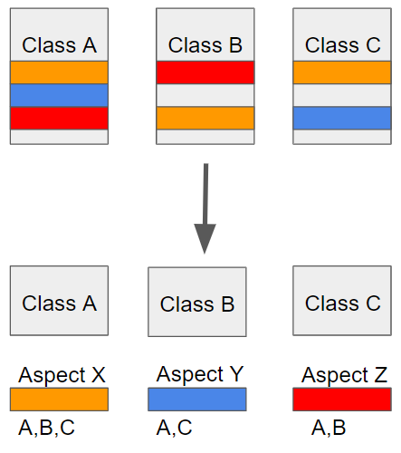
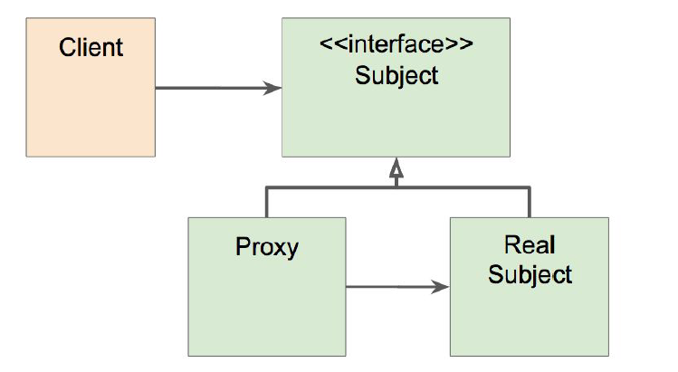

- [스프링 AOP](#%ec%8a%a4%ed%94%84%eb%a7%81-aop)
	- [AOP의 주요 개념](#aop%ec%9d%98-%ec%a3%bc%ec%9a%94-%ea%b0%9c%eb%85%90)
	- [AOP의 구현체](#aop%ec%9d%98-%ea%b5%ac%ed%98%84%ec%b2%b4)
	- [AOP 적용 방법](#aop-%ec%a0%81%ec%9a%a9-%eb%b0%a9%eb%b2%95)
		- [컴파일 (AspectJ)](#%ec%bb%b4%ed%8c%8c%ec%9d%bc-aspectj)
		- [로드타임 (AspectJ)](#%eb%a1%9c%eb%93%9c%ed%83%80%ec%9e%84-aspectj)
		- [런타임 (Spring AOP)](#%eb%9f%b0%ed%83%80%ec%9e%84-spring-aop)
	- [스프링 AOP의 특징](#%ec%8a%a4%ed%94%84%eb%a7%81-aop%ec%9d%98-%ed%8a%b9%ec%a7%95)
		- [프록시패턴 AOP](#%ed%94%84%eb%a1%9d%ec%8b%9c%ed%8c%a8%ed%84%b4-aop)
		- [스프링 AOP 사용하기](#%ec%8a%a4%ed%94%84%eb%a7%81-aop-%ec%82%ac%ec%9a%a9%ed%95%98%ea%b8%b0)
			- [1. 의존성 추가](#1-%ec%9d%98%ec%a1%b4%ec%84%b1-%ec%b6%94%ea%b0%80)
			- [2. Aspect 클래스 만들기](#2-aspect-%ed%81%b4%eb%9e%98%ec%8a%a4-%eb%a7%8c%eb%93%a4%ea%b8%b0)
			- [3. 포인트컷 표현식](#3-%ed%8f%ac%ec%9d%b8%ed%8a%b8%ec%bb%b7-%ed%91%9c%ed%98%84%ec%8b%9d)
			- [4. 어드바이스 정의](#4-%ec%96%b4%eb%93%9c%eb%b0%94%ec%9d%b4%ec%8a%a4-%ec%a0%95%ec%9d%98)

# 스프링 AOP



Aspect Oriented Programming(AOP)는 OOP를 보완하는 수단으로, 흩어진 Aspect를 모듈화하여 비즈니스 로직을 헤치지 않고 재사용하는 프로그래밍 기법이다.

## AOP의 주요 개념

- Aspect : 흩어진 관심사를 모듈화 한 것을 의미한다.
- Target : Aspect를 적용할 곳을 의미한다. (ex. Class A)
- Advice : 실직적으로 어떤 일을 해야할 지에 대해 정의한 내용. (ex. Aspect X의 노란색 코드)
- Join point : Advice가 적용될 수 있는 위치에 대한 스펙.
- Pointcut : 구체적인 Advice가 실행될 지점을 의미한다.

## AOP의 구현체

AOP의 구현체는 언어마다 다양하게 존재한다. 자바에서는 AspectJ와 스프링AOP가 존재한다.

## AOP 적용 방법

### 컴파일 (AspectJ)

Aspect로 분리한 코드들이 컴파일 시에 주입되도록 하는 방법이 있다. 즉, .java 파일이 .class 파일로 변환될 때, Aspect가 삽입되어 class 파일에 추가되도록 설정해준다.

단점으로는 별도 추가 컴파일이 필요하다는 점이 있다.

### 로드타임 (AspectJ)

.java 파일이 .class 파일로 변환될 때에도 Aspect가 주입되지 않고, JVM이 class 파일을 로드할 때, `위빙`에 의해 Aspect가 삽입되는 방식이다.

마찬가지로 별도의 작업이 필요하다는 단점이 있다.

### 런타임 (Spring AOP)



프록시 기반의 AOP. 프록시 객체를 사용하여 접근 제어 및 부가기능을 추가할 수 있다.

## 스프링 AOP의 특징

- 프록시 기반의 AOP 구현체
- 스프링 빈에만 AOP를 적용할 수 있다.
- 빈에 AOP를 적용하면, 그 빈 자체를 프록시 빈으로 생성한다.
- 인터페이스를 구현한 객체에 AOP를 적용하는 것이 좋다. 프록시 빈은 일반적으로 인터페이스에 기반을 두고 구현한다. 클래스를 기반으로 둘 경우 CGlib를 사용한다.
- 모든 AOP 기능을 제공하는 것이 목적이 아니라, 스프링 IoC와 연동하여 엔터프라이즈 애플리케이션에서 가장 흔한 문제에 대한 해결책을 제공하는 것이 목적이다.
  ex) 중복코드, 프록스 클래스 작성의 번거로움 등.

### 프록시패턴 AOP

프록시 패턴의 AOP의 원리를 적용한 코드를 보자.

```java
@Service
public class MyEventService implements EventService {

	@Override
	public void createEvent() {
		try {
			Thread.sleep(1000);
		} catch (InterruptedException e) {
			e.printStackTrace();
		}
		System.out.println("createEvent");
	}
}
```

```java
@Service
@Primary
public class ProxyEventService implements EventService {

	@Autowired
	MyEventService myeventService;

	@Override
	public void createEvent() {
		long start = System.currentTimeMillis();
		myeventService.createEvent();
		System.out.println(System.currentTimeMillis() - start);
	}
```

ProxyEventService는 EventService를 구현하고 있고, @Primary로 지정했기 때문에 외부에서 Autowired로 DI되는 빈은 ProxyEventService이다. 클라이언트는 EventService를 사용하는 것처럼 느끼지만, 실상은 ProxyEventService를 사용하게 된다.

이 프록시 패턴은 여전히 문제점을 가지고 있다.

- 매번 프록시 클래스를 작성해야 한다는 점
- 위의 예시처럼 시간측정을 하는 Aspect를 다른 클래스에서도 사용하고 싶다면, 새로운 프록시를 정의해야 한다는 점.

이러한 문제점들을 개선하기 위해 다이나믹 프록시 등 많은 기법이 있지만, 이 부분에 대해서는 생략한다.

토비의 스프링 3.1에 자세히 기술되어있지만 지금 당장 그 정도로 깊게 알아둘 필요는 없어 보인다. 따라서 이 문제점을 해결해주는 스프링 AOP의 사용법을 알아보자.

### 스프링 AOP 사용하기

#### 1. 의존성 추가

```xml
<dependency>
    <groupId>org.springframework.boot</groupId>
    <artifactId>spring-boot-starter-app</artifactId>
</dependency>
```

Gradle을 사용한다면,

```java
dependency{
    compile('org.springframework.boot:spring-boot-starter-aop')
}
```

#### 2. Aspect 클래스 만들기

Aspect 클래스는 Bean으로 등록되어있어야하며, @Aspect 애노테이션을 붙여 이 클래스가 Aspect임을 컨텍스트 애플리케이션에게 알려야 한다. 스프링IoC는 이 애노테이션이 붙은 클래스를 기존 빈을 대체하는 동적 프록시 빈으로 만들어 등록시켜준다.

```java
	@Component
	@Aspect
	public class PerfAspect {
```

<br>

그 다음으로, Advice(실질적으로 수행될 코드)를 정의한다. `@Around`는 타겟 메서드를 감싸서 특정 Advice를 실행한다는 의미이다. `ProceedingJoinPoint pjp`는 타겟 메서드고, pjp.proceed()는 타겟 메서드를 실행하는 명령이다.

`@Around()`의 괄호 부분에는 Pointcut이 들어간다. `@annotation(PerfLogging)`의 의미는 `@PerfLogging` 이라는 애노테이션이 붙은 메서드에 advice를 실행하라는 의미이다.

```java
	@Around("@annotation(PerfLogging)")
	public Object logPerf(ProceedingJoinPoint pjp) throws Throwable { //Advice가 적용될 대상 (메서드 그 자체)
		long start = System.currentTimeMillis();
		Object retVal = pjp.proceed();
		System.out.println(System.currentTimeMillis() - start);
		return retVal;
	}
```

<br>

`@Around`를 사용하면 타겟 메서드의 앞뒤에 호출될 코드를 작성할 수 있다. 만약 메서드 실행 전에만 호출되기를 원한다면, `@Before` 과 같은 애노테이션을 사용하면 된다.

```java
	@Before("bean(myEventService)")
	public void Hello(JoinPoint jp) {
		System.out.println("Hello");
	}
}
```

<br>

이번에는 Session Validation을 해주는 Aspect를 만들어보자. `ProceedingJoinPoint`와 `JoinPoint`에는 타겟 메소드의 이름, 매개변수 등을 저장하고 있는 `Signiture`라는 객체가 있다. 이번에는 타겟 메소드에 같이 넘겨진 매개변수를 불러와 세션을 검증하는 코드를 살펴보자.

```java
	@Around("@annotation(project.board.annotation.LoginAuth)")	//패키지 경로가 다를 경우.
	public String loginAuth(ProceedingJoinPoint pjp) throws Throwable {
		HttpSession session = null;
		for(Object o : pjp.getArgs()) {		//pjp.getArgs()는 Target에 넘겨진 매개변수들.
			if(o instanceof HttpSession) {
				session = (HttpSession) o;
			}
		}
		
		if(session.getAttribute("memberId")==null) {
			return "member/login";
		}
		return (String) pjp.proceed();
	}
```

#### 3. 포인트컷 표현식

- `execution("execution 표현식")`
  
execution의 사용법은 다음과 같다.

`execution([접근제한자 패턴] 리턴 값 패턴 [타입패턴.] 메소드이름 패턴 (파라미터 타입 패턴))`

여기서 []로 묶여있는 부분은 생략이 가능하다. `all()`이라는 Pointcut을 정의하고 `Advice`에서 이 포인트컷을 사용하는 예제를 보자.

`execution(* hello(..))`는 모든 리턴타입, 메소드 이름 hello, 모든 매개변수를 의미한다.

```java
public class 
	@Pointcut("execution(* hello(..))")
	private void all(){}

	@Around("all()")
	public Object printParametersAndReturnVal(ProceedingJoinPoint pjp) throws Throwable{
		...
		Object ret = pjp.proceed();
		...
		return ret;
	}
```

- `@annotation("annotation 이름")`

애노테이션을 이용하면 메소드 단위로 AOP를 적용할 수 있다는 장점이 있다.

```java
@Documented
@Target(ElementType.METHOD)
@Retention(RetentionPolicy.CLASS)
public @interface LoginAuth {	}

@Component
@Aspect
public class SessionValidAspect {
	
	@Around("@annotation(project.board.annotation.LoginAuth)")
	public String loginAuth(ProceedingJoinPoint pjp) throws Throwable {
		HttpSession session = null;
		for(Object o : pjp.getArgs()) {
			if(o instanceof HttpSession) {
				session = (HttpSession) o;
			}
		}
		
		if(session.getAttribute("memberId")==null) {
			return "member/login";
		}
		return (String) pjp.proceed();
	}
}
```

- `bean("빈 이름")`

특정 빈에 AOP를 적용할 수 있으나, 쓰임새가 가장 적다.

#### 4. 어드바이스 정의

- `@Before`
- `@AfterReturning`
- `@AfterThrowing`
- `@Around`

참고 자료

(https://docs.spring.io/spring/docs/current/spring-framework-reference/core.html#aop-pointcuts)
