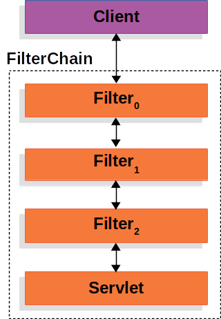
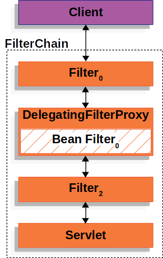
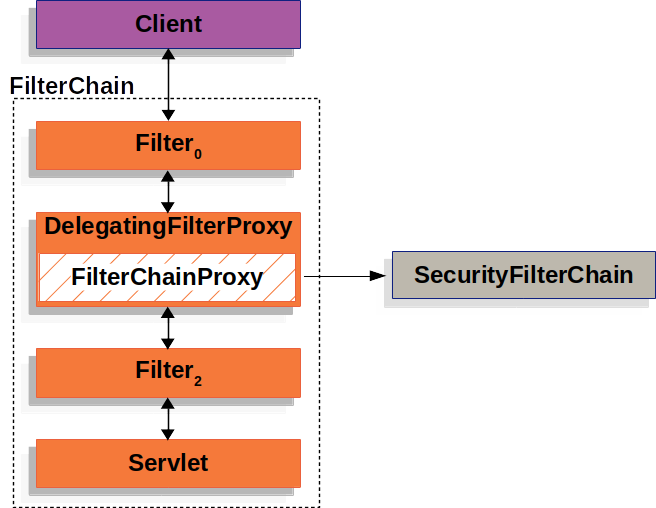
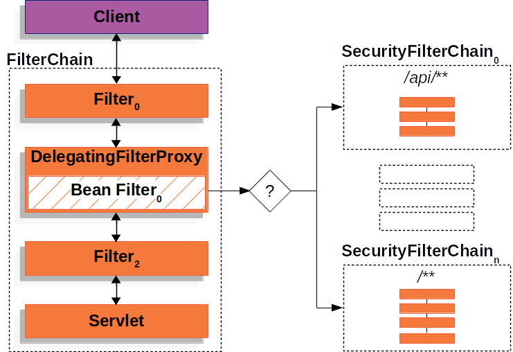

# Hello Spring Security

## Spring Boot Auto Configuration

- Spring Security는 `springSecurityFilterChain` 이라는 `Servlet Filter`를 생성하고 빈으로 등록합니다.

- `springSecurityFilterChain`는 `Servlet Container`로 들어오는 모든 요청에 대해 `Filter`를 적용합니다.

- `UserDetailsService`라는 빈을 생성해주고, 로그인을 할 수 있는 아이디(`user`)와 비밀번호(`콘솔에 찍힌 난수`)를 제공합니다.

- 기본전략으로 패스워드의 저장은 `BCrpyt`를 사용합니다.

- `Login Form`을 생성해서 제공합니다.

# Servlet Security

- 이 섹션에서는 Spring Security가 Servlet 기반의 애플리케이션에서 어떤 아키텍처로 구성되는지에 대해 중점적으로 다루게 됩니다.

## Review of Filter



- 필터는 여러 개 등록이 가능하며 필터체인에 의해 순차적으로 실행됩니다. 따라서 필터의 순서는 애플리케이션에 영향을 줄 수 있으므로 주의해야 합니다.

- 하단의 Servlet은 클라이언트의 요청을 처리하는 객체이지만, Spring MVC에서는 `DispatcherServlet`을 의미합니다.

## Delegating FilterProxy



- Filter는 `Servlet Container`에서 등록하는 것이 일반적입니다. 하지만 `Spring`은 `Bean`을 이용하여 Filter를 등록하기 때문에 이 둘의 `LifeCycle`에서 차이가 있음을 알 수 있습니다.

- 그림의 `Filter0`은 Spring bean으로 등록된 Filter이며, `DelegatingFilterProxy`는 `Filter0`을 감싼 프록시 객체입니다.

- `DelegatingFilterProxy`는 `Filter`의 역할을 Spring bean이 수행할 수 있도록 작업을 위임하는 역할을 합니다.

- 이 부분은 이해가 안돼도 가볍게 보고 넘어갑시다.

## FilterChainProxy



- `DelegatingFilterProxy`는 내부에 `FilterChainProxy`를 포함하고 있습니다.
- 이 `FilterChainProxy`은 `SecurityFilterChain`을 통해 Security와 관련된 Filter들을 적용할 수 있습니다.

## SecurityFilterChain


- `SecurityFilterChain`은 보안과 관련된 Filter를 가지고 있습니다.
- `Security Filter`는 `Bean` 이지만 `DelegatingFilterProxy`에 등록되는 것이 아니라, `FilterChainProxy`에 등록이 됩니다.
- 모든 요청에 대해 동일한 `SecurityFilterChain`을 사용하는 것은 부적절합니다. 따라서 `SecurityFilterChain`은 URL에 따라 전혀 다른 설정을 적용할 수 있습니다.

## Multiple SecurityFilterChain



- `FilterChainProxy`는 어떤 `SecurityFilterChain`을 사용해야 할지를 결정해 호출합니다.

- 매핑되는 url이 여러 개일 경우 가장 정확한 매핑을 지니고 있는 `SecurityFilterChain` **단 한개만** 수행됩니다.

## Security Filters

- [Security Filter 우선순위 참고](https://docs.spring.io/spring-security/site/docs/current/reference/html5/#servlet-security-filters)

## Handling Security Exceptions


- `ExceptionTranslatorFilter`를 사용하면 `AccessDeniedException`과 `AuthenticationException`을 HTTP Response로 전송할 수 있습니다.

- `ExceptionTranslatorFilter`는 `Security Filter` 중 하나이며, `FilterChainProxy`에 등록된다. Exception을 처리하는 Filter이므로 우선순위는 낮은 편에 속합니다.

1. `ExceptionTranslatorFilter`는 `FilterChain.doFilter(req,res)`를 다음 Filter(또는 로직)를 수행합니다.

2. 만약 수행하는 도중에 `AuthenticationException`이 발생하거나, 인증이 수행되지 않았다면, `Start Authentication(인증)`을 시작합니다.

   1. 먼저 `SecurityContextHolder`를 비웁니다. (뒤에서 다룸.)

   2. `HttpServletRequest`를 `RequestCache`에 저장하며 인증이 정상적으로 끝난 경우, 기존의 요청을 이어서 진행할 수 있도록 도와줍니다.

   3. `AuthenticationEntryPoint`는 로그인 페이지로 redirect 시키거나 `WWW-Authentication` 헤더를 전송합니다.

3. `AccessDeniedException`이 발생한 경우 `AccessDeniedHandler`가 호출되며 접근을 거절합니다.

**Pseudo Code**

```java
try {
    filterChain.doFilter(request, response);                    // (1)
} catch (AccessDeniedException | AuthenticationException e) {
    if (!authenticated || e instanceof AuthenticationException) {
        startAuthentication();                                  // (2)
    } else {
        accessDenied();                                         // (3)
    }
}
```
