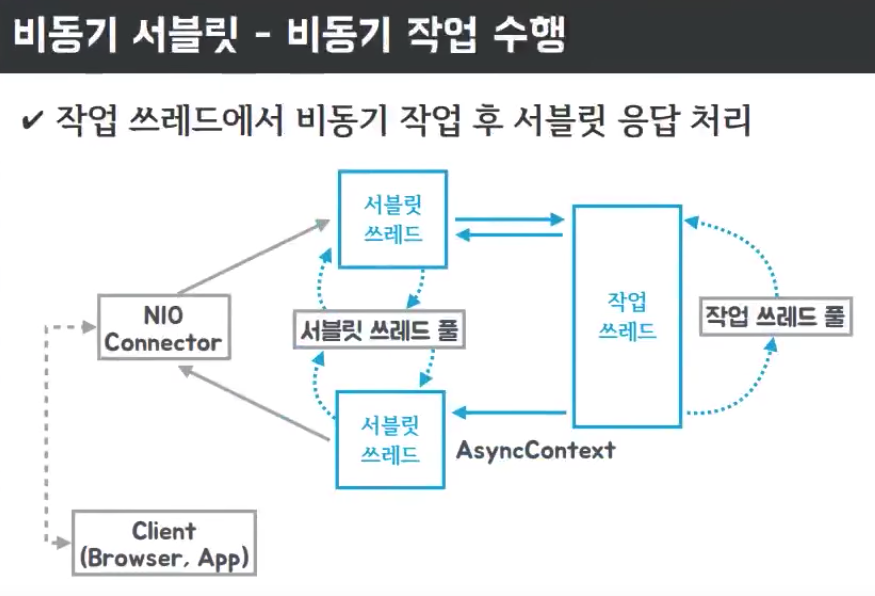
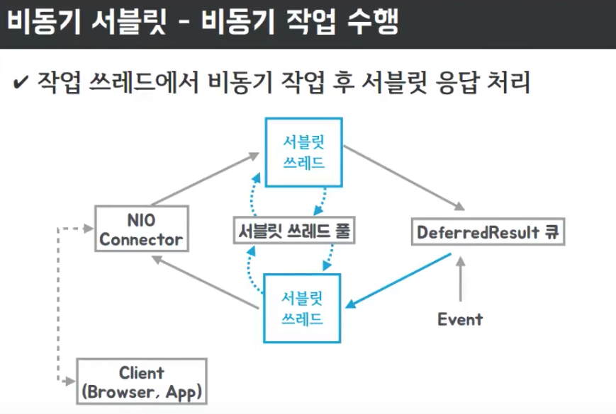
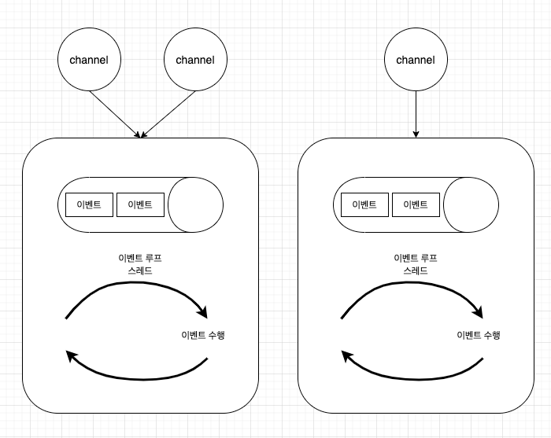

# 비동기 프로그래밍의 발전

## Future

Future는 비동기 처리의 가장 기본이 되는 인터페이스이다. 비동기 작업을 수행한 결과를 Future 객체로 받을 수 있다.

```java
ExecutorService es = Executors.newCachedThreadPool();

Future<String> f = es.submit(() -> {
    Thread.sleep(2000);
    log.info("Async");
    return "Hello";
});

log.info("Another business logic");
log.info(f.get());
log.info("Exit");
```

- ExecutorService는 Thread pool이며, Exectuors를 이용하여 편리하게 생성이 가능하다.
- ExecutorService에는 `execute()` 메서드가 존재하는데, 이 메서드는 Runnable Interface를 받아서 처리한다.
  - Runnable의 run 메서드는 반환타입을 갖지 않는다.
  - 예외처리 또한 Runnable 안에서 독자적으로 처리해야 한다.
- ExecutorService에는 `submit()` 메서드가 존재하는데, 이 메서드는 Callbale Interface를 받아서 처리한다.
  - Callable의 call() 메서드는 반환타입이 존재하므로, 비동기 처리 결과를 호출한 쪽에서 받아서 처리할 수 있다.
  - call() 메서드는 예외를 throw 하고 있으므로 호출하는 쪽에서 예외처리가 가능하다.
- `Future::get` 메서드는 blocking 메서드이므로 작업이 완료될 때까지 대기한다.

## FutureTask

Future를 이용해서 비동기 처리는 가능하지만, 비동기 처리가 끝난 후의 동작을 정의해야 하는 경우, `Future::get`을 호출하여, 비동기 처리가 끝날 때까지 대기해야 한다. 만약 비동기 처리의 작업이 위와 같이 단순히 로그를 찍는 작업일 뿐인데도 유저는 비동기 처리가 끝날 때까지 대기해야만 한다. 이러한 문제를 FutureTask를 이용해 callback 형태로 구현이 가능하다.

FutureTask는 Java 1.5부터 사용이 가능한 기술이다.

FutureTask는 미래에 수행해야 할 Runnable(Callbale) 인터페이스를 생성자 파라미터로 받는다. FutureTask 객체는 비동기 작업이 끝나면, `FutureTask::done` 메서드를 호출한다.

```java
ExecutorService es = Executors.newCachedThreadPool();

FutureTask<String> ft = new FutureTask<>(() -> {
    Thread.sleep(2000);
    log.info("Async");
    return "Hello";
}) {
    @SneakyThrows
    @Override
    protected void done() {
        log.info(get());
    }
};

es.execute(ft);
es.shutdown();
```

- `FutureTask::done`이 호출된다는 점을 이용하여, 해당 메서드를 Override하여 callback 함수처럼 사용할 수 있다.
- 다만 이러한 방식은 코드의 가독성을 매우 저하시키기 때문에 Java 1.7까지는 CallbackFutureTask 같은 클래스를 직접 정의하여 사용했다.

```java
interface SuccessCallback {
    void onSuccess(String result);
}

interface ExceptionCallback {
    void onError(Throwable t);
}

public class CallbackFutureTask extends FutureTask<String> {
    SuccessCallback sc;
    ExceptionCallback ec;

    public CallbackFutureTask(Callable<String> callable, @NonNull SuccessCallback sc, @NonNull ExceptionCallback ec) {
        super(callable);
        this.sc = Objects.requireNonNull(sc);       //null이면 NPE 발생.
        this.ec = Objects.requireNonNull(ec);
    }

    @Override
    protected void done() {
        try {
            sc.onSuccess(get());
        } catch (InterruptedException e) {
            // 작업을 지금 하지말고 종료하라는 signal을 받았다는 의미이므로 Exception의 성격이 조금 다름.
            // 그냥 다시 interrupt를 걸어주면 됨.
            Thread.currentThread().interrupt();
        } catch (ExecutionException e) {
            // 비동기 작업 중 예외가 발생한 케이스
            ec.onError(e.getCause());   //e 자체는 wrapping class이므로 getCause를 꺼냄.
        }
    }
}

// test code
public static void main(String[] args) {
    ExecutorService es = Executors.newCachedThreadPool();
    //onSuccess
    CallbackFutureTask f = new CallbackFutureTask(() -> {
        Thread.sleep(2000);
        log.info("Async");
        return "Hello";
    }, result -> log.info(result), e -> log.info("Error : " + e.getMessage()));

    es.execute(f);

    //onError
    CallbackFutureTask f2 = new CallbackFutureTask(() -> {
        Thread.sleep(2000);
        if (1 ==1) throw new RuntimeException("Async Error");
        return "Hello";
    }, result -> log.info(result), e -> log.info("Error : " + e.getMessage()));

    es.execute(f2);

}
```

- FutureTask와 달리 성공과 실패에 동작할 callback을 직접 정의해서 사용할 수 있다.
- 하지만, 비즈니스 코드와 기술적인 코드가 혼재 되어있다는 단점이 있음.


## Spring @Async, ListernableFuture

Spring에서도 비동기 작업을 지원하기 위해 `@Asnyc` 기능을 제공해주었다. `@Async` 기능을 사용하기 위해서는 `@EnableAsync`의 선언과 Thread pool을 bean으로 등록해두어야 한다. Thread pool은 등록하지 않아도 Spring에 의해 자동으로 등록되지만, Spring이 등록해주는 Thread pool은 maximum의 제한이 없으므로 반드시 customizing해서 사용해야 한다.

```java
@SpringBootApplication
@EnableAsync
public class ReactiveProgrammingApplication implements AsyncConfigurer {

    public static void main(String[] args) {
        SpringApplication.run(ReactiveProgrammingApplication.class, args);
    }

    @Override
    public Executor getAsyncExecutor() {
        ThreadPoolTaskExecutor executor = new ThreadPoolTaskExecutor();
        executor.setCorePoolSize(2);            //시작 시 쓰레드 2개 할당.
        executor.setMaxPoolSize(100);           //최대 100개까지 쓰레드 사용 가능.
        executor.setQueueCapacity(5);           //쓰레드 2개가 모두 사용 중일 경우, 큐에서 대기를 진행. 큐가 가득 차면 쓰레드를 할당.
        executor.setThreadNamePrefix("myAsync-");
        executor.initialize();
        return executor;
    }

    @Override
    public AsyncUncaughtExceptionHandler getAsyncUncaughtExceptionHandler() {
        return new SimpleAsyncUncaughtExceptionHandler();
    }
}
```

- setCorePoolSize: 쓰레드 풀에서 사용될 코어 사이즈 개수. 처음 세팅될 때 지정된 숫자만큼의 쓰레드가 생성된다.
- setMaxPoolSize: 최대 쓰레드 개수. 요청이 몰리게 되면 maxPoolsize 만큼의 쓰레드가 생성될 수 있다.
- setQueueCapacity: core thread가 전부 사용 중인 경우, 다음 요청들은 queue에서 대기한다. 이때의 queue size. 만약 queue size가 가득찬 경우, 쓰레드의 개수가 1개 늘어난다.
- setWaitForTasksToCompleteOnShutdown() : 비동기 작업이 종료되지 않았을 때, 서버가 내려가는 경우 비동기 작업을 마저 수행할 지 여부를 결정한다.
- setAwaitTerminationSeconds(): 서버가 종료될 때 비동기 작업의 수행을 위해 얼마나 대기할 것인지를 의미한다.
- setThreadNamePrefix() : 쓰레드 풀에 존재하는 쓰레드의 이름에 prefix를 정의한다. 디버깅을 위해 설정하는 것이 좋다.
- initialize(): 쓰레드 풀을 초기화 한다.

위와 같이 풀을 설정했다면, 비동기 처리를 하고 싶은 메서드에 `@Async` 애노테이션만 붙여주면 된다. 다만, `@Async` annotation이 붙은 경우, 비동기로 처리되는 이유는 Spring이 AOP를 이용해서 다른 Porxy 객체를 호출해주기 때문이다. 따라서 AOP를 사용할 때와 마찬가지로, public method에만 동작하며, self-invocation이 불가하다는 점에 유의하자.

```java
@Service
public class MyService {
    @Async
    public Future<String> hello() throws InterruptedException {
        log.info("hello");
        Thread.sleep(1000);
        return new AsyncResult<>("hello");
    }

    @Async
    public ListenableFuture<String> hello2() throws InterruptedException {
        log.info("hello");
        Thread.sleep(1000);
        return new AsyncResult<>("hello");
    }

    @Async
    public ListenableFuture<String> work(String name) {
        return new AsyncResult<>(name);
    }
}
```

- 비동기 처리 결과를 받아야 하는 경우, `Future`를 사용할 수도 있지만 이 방법은 위에서 봤듯이 Future::get 호출 시 blocking 된다는 단점이 있다.
  - 비동기 처리 결과를 확인하기 위한 방법으로 결과를 DB에 저장하거나, HttpSession에 Future를 넣어두고 `Future::isDone`을 이용해 체크하기도 했다. (고전적인 방법.)
- Spring 4.0부터 지원되는 ListernableFuture는 callback 기능이 있는 Future이다. 이 객체를 이용하면 조금 편리하게 callback 등록처리가 가능하다.

```java
public static void main(String[] args) {
    log.info("run()");
    ListenableFuture<String> f = service.hello(); //시간이 많이 걸리는 작업.
    f.addCallback(s -> log.info("callback" + s), e -> log.info(e.getMessage()));
}
```

- `addCallback()` 메서드를 이용해서 성공했을 때의 callback과 실패했을 때의 callback을 처리할 수 있다.
- 이 방식을 이용하면 비동기 처리가 끝났을 때 동작해야하는 작업들을 미리 정의해두기만 하면 되므로, 작업이 끝났는지에 대해서는 지속적으로 체크할 필요는 없다.
- `ListenableFuture`를 이용하면 callback 처리를 할 수 있지만, 비동기 처리 작업들을 조합해서 Client에게 응답해야 한다면 처리가 불가능하다는 문제가 여전히 남아있다.

## AsyncServletProcess

새로운 기술을 더 배우기 전에 Tomcat의 thread pool에 대해서 얘기를 해보자. Spring boot를 사용하면 기본적으로 embedded tomcat을 사용하게 된다. tomcat은 client에게 요청을 받으면, 요청 1개마다 Thread를 하나씩 할당해준다. 이를 도식화해보면 다음과 같다.

```
Tomcat (Thread pool size : 5). default size : 200
요청1      ServletThread1  -> [ req -> blocking I/O (DB, API) -> res ]
요청2      ServletThread2
요청3      ServletThread3
요청4      ServletThread4
요청5      ServletThread5
```

각각의 요청에 따라 ServletThread를 하나씩 할당해주므로, default size가 200이라면 동시에 처리할 수 있는 유저의 수는 200명 이다. Client에게 응답할 response 내용을 가공하는 데에 많은 시간이 걸리지 않는다면 별다른 문제가 되지 않는다. 하지만, 대부분의 서비스가 그렇듯, 요청을 받게되면 DB에서 데이터를 조회하고 응답하게 된다. 하지만 이런 DB의 조회 작업은 blocking I/O 연산이므로 DB의 조회가 끝날 때까지 ServletThread는 대기하고 있는 상태가 된다. 이때, blocking I/O 시간동안 다른 쓰레드의 작업을 처리하기 위해 Context switching이 발생하게 되고 이렇게 CPU 자원을 사용하게 된다. 만약, 모든 쓰레드가 사용 중이라면, 나머지 요청들은 Queue에서 대기를 하게 되므로, 각 요청에 대한 처리율이 떨어진다면 Queue에 점점 요청들이 쌓이게 되고 서비스의 장애로 이어질 수 있다.

이 상황을 자세히 들여다보면 blocking I/O로 인해서 Latency가 높아지고, 처리율은 낮아진다는 것을 알 수 있다. 심지어 context switching으로 인한 CPU 사용률 또한 높다. 단순히 유저에 대한 Latency를 낮추기 위해 쓰레드 풀의 사이즈를 늘리면 어떻게 될까? Thread 하나 당 약 1MB의 메모리를 사용하게 되므로 메모리 사용률이 높아지고, Thread 수가 많아짐에 따라 context switching의 횟수가 증가한다. 즉, 쓰레드의 개수가 늘었지만 요청이 몰린 경우, 레이턴시는 오히려 높아지고 처리율은 더 낮아질 수 있다.

### AsyncServlet

Servlet 3.0부터는 Async Servlet이 등장하였고, ServletThread가 비동기 작업 단계에 들어갔을 때, ServletThread를 즉시 반환하고 비동기 작업이 끝나면 ServletThread를 재할당받는 기술을 적용했다. 하지만 Servlet 요청을 읽고 쓰는 작업은 RequestHttpServletRequest, RequestHttpServletResponse를 활용하기 때문에 여전히 blocking I/O 작업이다. (InputStream, OutputStream이 blocking I/O)

비동기 서블릿의 비동기 작업 처리 과정을 보면 다음과 같다.



클라이언트의 요청이 들어오면 NIO Connector에 전달이 되고, NIO Connector는 ServletThread pool에서 thread 하나를 할당해준다. ServletThread는 비동기 작업을 만나게 되면, Spring task execution pool에서 worker thread를 하나 할당받아서 worker thread에서 작업을 처리한다. worker thread의 작업이 끝나면 ServletThread pool에서 새로운 thread를 할당받아 유저에게 응답을 하는 구조이다.

ServletThread를 즉시 반납하기 때문에 servletThread의 개수를 1개로 제한하더라도 꽤 빠른 속도로 유저에게 응답이 가능하다. 하지만 이는 뒷단에 worker thread의 개수가 늘어나므로 전체적인 시스템으로 봤을 때는 큰 효용은 없다. 작업 시간이 오래걸리는 경우, worker thread를 이용하면 servletThread를 빠르게 반납할 수 있다는 점만 기억하자.

worker thread pool의 사이즈를 조절하기 위한 방법은 다음과 같다.

프로퍼티를 이용한 방식.

```property
spring.task.execution.pool.core-size=100
```

Java를 이용한 Configuration

```java
@Configuration
@EnableWebMvc
public class WebMvcConfig implements WebMvcConfigurer {

    @Override
    public void configureAsyncSupport(AsyncSupportConfigurer configurer) {
        ThreadPoolTaskExecutor te = new ThreadPoolTaskExecutor();
        te.setCorePoolSize(100);
        te.setQueueCapacity(50);
        te.setMaxPoolSize(200);
        te.setThreadNamePrefix("workThread");
        te.initialize();
        configurer.setTaskExecutor(te);
    }
}

```

Spring에서 요청을 worker thread로 넘기는 방법은 꽤 간단하다. Controller에서 응답 객체를 Callbale<T>로 명시해주면 Spring이 자체적으로 비동기 작업으로 인지하고 worker thread에 할당하고, servletThread는 즉시 반환한다.

```java
//동기
@GetMapping("/sync")
public String sync() throws InterruptedException {
    log.info("async");
    Thread.sleep(2000);     //시간이 오래걸리는 작업
    return "sync";
}

//비동기
@GetMapping("/callable")
public Callable<String> callable() throws InterruptedException {
    log.info("callable");
    return () -> {
        log.info("async worker thread");
        Thread.sleep(2000);     //시간이 오래걸리는 작업
        return "hello";
    };
}
```

- `/sync`는 동기작업이므로 servletThread를 즉시 반환하지 않는다. 따라서 100개의 요청이 들어오면 1개의 요청씩 순차적으로 처리하고, nio-8080-exec-1 쓰레드를 반복적으로 사용하는 걸 확인할 수 있다. (쓰레드 개수가 1개라는 가정.)

- `/async`는 `log.info("callable")`는 servletThread를 사용하고 return 부분은 worker thread에게 작업을 위임하므로 다른 쓰레드를 사용하는 걸 확인할 수 있다.

## DeferredResult



Servlet 3.0 이상의 비동기 기술을 쓰면, servletThread는 효율적으로 사용하는 것을 확인했지만 결국 worker thread의 개수가 늘어나므로 JVM에서 사용하는 thread의 숫자는 전혀 줄어들지 않았다. `DeferredResult`를 이용하면 worker thread를 생성하지 않고도 비동기를 효율적으로 처리할 수 있다.

`DeferredResult`는 지연된 결과라는 의미이며, Spring 3.2부터 해당 객체를 응답 값으로 사용하는 경우에 클라이언트는 지연된 상태(응답을 받지 못한 상태)로 유지된다. 이때, 외부의 이벤트가 발생하여 `setResult`가 호출되면 그 시점에 HTTP 응답을 하게 된다. 즉, 이 기술을 활용하면 클라이언트에게 DeferredResult를 전달하고, 응답을 나중에 작성해줄 수 있게 된다.


```java
@RestController
@Slf4j
public class _06_DeferredResultQueueEx {
    /**
     *
     * 즉, 아래 예시에서는 '/dr'을 호출했을 때는 대기상태에 빠지고, '/dr/event'가 호출되면 비로소 응답이 되는 것을 볼 수 있음.
     *
     * ex) 사용예시 (적절한 방법은 아님)
     * 채팅방에 30명이 들어가있을 때, DeferredResult로 대기상태에 있다가 event가 발생하면 30명에게 메시지를 전달.
     * 메시지를 전달하면 또 DeferredResult로 대기상태에 진입.
     *
     * ex) 사용예시
     * 이메일이나 어떤 결과를 다른 서비스로부터 받았을 때 그 결과를 알려주어야 할 때 사용할 수도 있음.
     *
     */
    Queue<DeferredResult<String>> results = new ConcurrentLinkedDeque<>();

    @GetMapping("/dr")
    public DeferredResult<String> deferredResult() {
        log.info("deferredResult");
        DeferredResult<String> dr = new DeferredResult<>(60*1000L);
        results.add(dr);
        return dr;
    }

    @GetMapping("/dr/count")
    public String drCount() {
        return String.valueOf(results.size());
    }

    @GetMapping("/dr/event")
    public String drEvent(String msg) {
        for (DeferredResult<String> dr : results) {
            dr.setResult("Hello " + msg);
            results.remove(dr);
        }
        return "OK";
    }

    static AtomicInteger idx = new AtomicInteger(0);
    public static void main(String[] args) throws InterruptedException {
        ExecutorService es = Executors.newFixedThreadPool(100);
        RestTemplate restTemplate = new RestTemplate();
        String url = "http://localhost:8080/dr";
        StopWatch main = new StopWatch();
        main.start();

        for (int i = 0; i < 100; i++) {
            es.execute(() -> {
                int index = idx.getAndIncrement();
                log.info("Thread {}", index);

                StopWatch sw = new StopWatch();
                sw.start();
                restTemplate.getForObject(url, String.class);
                sw.stop();

                log.info("Elapsed: {} -> {} " , index, sw.getTotalTimeSeconds());
            });
        }

        es.shutdown();      //graceful한 shutdown이므로 shutdown 명령이 호출된다고 바로 종료되는 것이 아님.
        es.awaitTermination(100, TimeUnit.SECONDS); // 100초간 대기.(blocking) 작업이 완료됐으면 무시하고 종료됨.
        main.stop();
        log.info("Total : {}", main.getTotalTimeSeconds());
    }
```

- Thread safe한 객체를 사용하기 위해 `ConcurrentLinkedDeque`를 사용한 모습.
- `new DeferredResult<>(60*1000L)` 처럼 최대 지연시간을 지정할 수 있음.
- '/dr'을 호출했을 때는 대기상태에 빠지고, '/dr/event'가 호출되면 비로소 응답이 되는 것을 볼 수 있음.
- 100개의 요청이 들어왔을 때, DeferredResult를 응답하므로 worker thread는 생성되지 않는다.
- /dr/event 요청이 발생하면 DeferredResult에 데이터를 삽입하게 되고, 이때 비로소 Servlet Thread를 재할당받아 응답 메시지를 가공한다.

## ResponseBodyEmitter, SseEmitter, StreamingResponseBody

Spring 4.2부터 도입된 기술로 응답 데이터를 1개만 반환하는 것이 아니라, 데이터를 여러 번에 나누어 보낼 수 있게 됐다. 즉, 클라이언트는 1번의 요청을 보냈지만, 실제 응답은 여러 번에 걸쳐서 데이터를 전달하는 것이다. 이러한 방식을 사용했을 때, 클라이언트는 최초의 response를 받는 시간이 짧아지므로 반응성이 높다는 느낌을 받을 수 있다. 이러한 기법이 reactive programming의 기초가 된다.

Spring에서는 Emitter를 이용하면 Http의 복잡한 설정없이도 Streaming 형태로 데이터를 전달할 수가 있다.

```java
@RestController
@Slf4j
public class _07_EmitterEx {
    @GetMapping("/emitter")
    public ResponseBodyEmitter emitter() {
        ResponseBodyEmitter emitter = new ResponseBodyEmitter();

        ExecutorService es = Executors.newSingleThreadExecutor();
        es.submit(() -> {
            for(int i=1; i<=50; i++) {
                try {
                    emitter.send("<p>Stream " + i + "</p>");
                    Thread.sleep(100);
                } catch (Exception e) {
                    e.printStackTrace();
                }
            }
        });

        return emitter;
    }
```

- 요청을받으면, ResponseBodyEmitter를 응답 객체로 전달하고, worker thread를 이용해 emitter.send()를 50번 반복하는 코드이다. 이때, Client의 화면에는 50개의 데이터가 100ms 간격으로 도착한다.

## Thread pool hell

Thread Pool Hell이란 풀 안에 있는 스레드에 대한 사용 요청이 급격하게 증가해 추가적인 요청이 들어올 때, 사용 가능한 스레드 풀의 스레드가 없기 때문에 대기 상태에 빠져 요청에 대한 응답이 느려지게 되는 상태를 말한다. 하나의 컴포넌트에서 다른 컴포넌트들을 호출할 때, worker thread들이 Blocking I/O로 인해 작업을 할 수 없는 상태가 주로 발생한다.

## RestTemplate

```java
@RestController
@Slf4j
public class RestTemplateEx {
    private RestTemplate restTemplate = new RestTemplate();

    @GetMapping("/rest")
    public String rest(String idx) {
        String res = restTemplate.getForObject("http://localhost:8081/remote?req={req}", String.class, idx);
        return res;
    }
}
```

- 예상했다시피 하나의 servletThread를 사용하므로, 순차적으로 요청을 하나씩 처리하게 된다. 즉, `remote` API 응답이 1초 뒤에 도달한다면, 다음 클라이언트의 응답은 1초 뒤에나 처리할 수 있다.

<hr>

### AsyncRestTemplate (Async Blcoking)

위의 문제점을 개선하기 위해 비동기적으로 Http 통신을 할 수 있는 AsyncRestTemplate이 Spring 4.0 부터 등장했다. AsyncRestTemplate의 응답 값은 ListenableFuture<T>로 받을 수 있다. 앞서 얘기한 것처럼 ListenableFuture를 Controller의 응답 값으로 두게 되면 ServletThread는 새로운 요청을 받을 수 있으므로 비동기 API 통신이 가능하다. 하지만, 이 방법은 worker thread에 작업을 할당하여 처리하는 것이기 때문에 비동기 서블릿을 이용한 처리와 다를 바가 없다. 이런 방식은 비동기 블로킹이라고 부른다.

```java
@RestController
@Slf4j
public class AsyncRestTemplateEx {
    AsyncRestTemplate asyncRestTemplate = new AsyncRestTemplate();
    @GetMapping("/async-rest")
    public ListenableFuture<ResponseEntity<String>> asyncRest(String idx) {
        return asyncRestTemplate.getForEntity("http://localhost:8081/remote?req={req}", String.class, idx);
    }
}
```

- AsyncRestTemplate은 Spring 5.0부터는 WebClient를 사용하도록 권고하고 있으므로 Deprecated 되었다.


## AsyncRestTemplate with Netty (Async Non blocking)

Netty는 비동기 이벤트 기반의 네트워크 응용프로그램 프레임워크로 알려져있다. Netty를 이용하면 비동기 논블로킹 작업을 처리할 수 있으며, 최소 10만개 이상의 클라이언트 커넥션을 처리할 수 있다고 할 정도로 이미 많은 인정을 받고 있다.

netty를 이용하면 네트워크 I/O 연산을 수행할 때에도 non-blocking이 가능하게 된다. 즉, HTTP 요청을 보내고 응답이 올 때까지 worker thread가 대기상태에 머무르는 것이 아니라, HTTP 요청을 보내는 즉시 worker thread 또한 재사용할 수 있는 상태가 된다. 응답이 도착했다는 이벤트가 발생하면 다시 worker thread를 할당받아 작업을 처리하는 방식이라고 이해하면 된다. 즉, netty를 이용하면 HTTP 요청마다 1개의 thread를 사용하는 것이 아니므로 쓰레드의 개수를 대폭 줄일 수 있다.



Netty의 각 EventLoop는 위의 이미지처럼 독립적인 Queue를 가지고 있다. EventLoopGroup의 사이즈가 8이라면, 8개의 EventLoopThread가 생성된다. Netty의 이벤트 루프에 작업을 등록하는 방법은 Channel을 통해서 등록하는 것이 유일하며, 하나의 Channel은 하나의 이벤트 루프 등록된다. 이런 식으로 설계한 이유는 각 작업 간의 순서를 보장해주기 위함이다. 

이벤트 루프 쓰레드의 개수는 보통 core * 2의 개수로 설정하기 때문에 각 이벤트 루프가 blocking된다면 해당 queue에 남아있는 작업들을 진행하지 못할 수 있으므로 이벤트 루프는 blocking 되지 않게 각별히 주의해야한다.

그렇다면, DB write나 네트워크 통신처럼 blocking I/O가 발생할 수 밖에 없는 작업은 어떻게 처리해야할까? Netty는 ChannelHandler를 등록해서 처리할 수 있다. ChannelHandler에서 `addAfter()`를 지정해둔다면 별도의 defaultEventExecutorGroup 이라는 쓰레드 풀에서 작업 쓰레드를 할당해서 처리한다.

<hr>

Netty를 사용하기 위해서는 다음과 같이 의존성을 추가해야 한다.

```xml
<dependency>
    <groupId>io.netty</groupId>
    <artifactId>netty-all</artifactId>
</dependency>
```

AsyncRestTemplate을 만들 때에도 Netty의 Netty4ClientHttpRequestFactory를 이용할 수 있도록 설정해야 한다.

```java
@RestController
@Slf4j
public class NettyAsyncTemplateEx {
    AsyncRestTemplate nettyAsyncRestTemplate = new AsyncRestTemplate(new Netty4ClientHttpRequestFactory(new NioEventLoopGroup(8)));
    @GetMapping("/netty-async-rest")
    public ListenableFuture<ResponseEntity<String>> nettyRest(String idx) {
        return nettyAsyncRestTemplate.getForEntity("http://localhost:8081/remote?req={req}", String.class, idx);
    }
}
```

- `new NioEventLoopGroup(8)`은 netty에서 network nonblocking I/O를 위해 사용할 쓰레드의 개수를 의미한다. 일반적으로 core 개수 * 2 정도로 설정한다.
- 100개의 요청이 들어와도 8개의 쓰레드만을 가지고 작업을 처리하기 때문에 효율적이다.

## Netty & DeferredResult

위의 코드를 이용하면 servletThread와 nioEventLoopGroup을 적게 쓴다는 장점을 확인했지만 여전히 문제가 있다. ListenableFuture에서 언급했던 것처럼 callback을 할 수는 있지만, 유저가 원하는 결과로 데이터를 가공해서 주는 것이 불가능하다는 점이다.

이러한 문제를 DeferredResult와 함께 쓰면 손쉽게 해결이 가능하다.

```java
@RestController
@Slf4j
public class AsyncRestTemplateAndDeferredResult {
    AsyncRestTemplate nettyAsyncRestTemplate = new AsyncRestTemplate(new Netty4ClientHttpRequestFactory(new NioEventLoopGroup(8)));
    @GetMapping("/netty-async-dr")
    public DeferredResult<String> asyncDr(String idx) {
        DeferredResult<String> dr = new DeferredResult<>();
        ListenableFuture<ResponseEntity<String>> lf = nettyAsyncRestTemplate.getForEntity(
                "http://localhost:8081/remote?req={req}", String.class, idx);

        lf.addCallback(s -> {
            dr.setResult(s.getBody() + "/dr");
        }, e -> {
            //여기서 예외를 전파할 경우, 어떤 쓰레드에게 전파될 지 모르므로 dr을 이용한다.
            dr.setErrorResult(e);
        });
        return dr;
    }
}
```

- 클라이언트에게는 지연된 응답을 위해 DeferredResult를 응답한다.
- 비동기 Http 통신이 끝나면, 그 결과를 DeferredResult에 넣어주기 위해, ListenableFuture의 callback을 이용한다.
- addCallback을 이용해서 비동기 통신의 결과를 `dr.setResult()`와 `dr.setErrorResult()`에 넣어, 이벤트를 발생시킨다.
- DeferredResult에 데이터가 삽입되는 이벤트가 발생하면, ServletThread를 할당받게 되어 클라이언트에게 응답을 하게 된다.

<hr>

## Callback Hell

여러 개의 API call이 필요하고, API call 사이에 순서가 존재한다면 어떻게 해야할까? 위의 코드를 봐서 알겠지만 callback 안에서 비동기 Http 통신을 한 번 더 진행하면 된다.

대부분이 짐작하듯이, 이렇게 작성된 코드는 잘 알려진 문제 `Callback hell`을 야기한다. `Callback hell`은 Callback 안에 Callback이 여러 번 중첩되는 형태로 너무 많은 들여쓰기로 인해 코드 가독성이 심각하게 저하되는 현상을 의미한다.

이러한 문제가 발생하는 이유는 비동기 프로그래밍에 명령형 프로그래밍 기법을 적용하고 있기 때문이다.

```java
@RestController
@Slf4j
public class AsyncRestTemplateAndDeferredResult {
    @GetMapping("/netty-async-callback")
    public DeferredResult<String> callback(String idx) {
        DeferredResult<String> dr = new DeferredResult<>(5000L);
        ListenableFuture<ResponseEntity<String>> lf = nettyAsyncRestTemplate.getForEntity(
                "http://localhost:8081/remote?req={req}", String.class, idx);

        lf.addCallback(s -> {
            log.info("[lf callback]: {}, {}", Thread.currentThread(), s.getBody());
            ListenableFuture<ResponseEntity<String>> lf2 = nettyAsyncRestTemplate.getForEntity(
                    "http://localhost:8081/remote2?req={req}", String.class, s.getBody());
            lf2.addCallback(s2 -> {
                log.info("[lf2 callback]: {}, {}", Thread.currentThread(), s2.getBody());
                dr.setResult(s2.getBody() + "/dr");
            }
            , e2 -> dr.setErrorResult(e2));
        }, e -> dr.setErrorResult(e));

        return dr;
    }
}
```

- callback 안에서 callback을 호출하고 있어 코드의 가독성이 나쁘다.
- 반복적인 예외처리 로직이 들어가는 부분을 개선할 수 있지는 않을까?

## CompletableFuture

Java 8부터 도입된 CompletableFuture를 이용하면 Callback hell을 해결할 수 있고, 비동기 작업을 생성하는 것 또한 편리하다.

CompletableFuture의 complete는 Future task가 성공적으로 종료되었을 때 호출한다. completeExceptionally는 Future task가 수행 중에 예외 상황을 맞이했을 때 호출된다. 이러한 결과는 CompletableFuture::get이 호출될 때 메시지를 얻거나 예외가 발생한다.

CompletableFuture는 CompletionStage를 구현하고 있고, 이 Interface의 특징은 CompletableFuture를 Chaining해서 쓸 수 있게 해준다. chaining을 해서 쓸 수 있기 때문에 callback hell에서 벗어날 수 있게 된다.

```java
public class CompletableFutureEx {
    public static void main(String[] args) throws ExecutionException, InterruptedException {
       CompletableFuture.runAsync(() -> log.info("runAsync"))
                        .thenRun(() -> log.info("thenRunAsync"))
                        .thenRun(() -> log.info("thenRunAsync2"));

        log.info("exit");

        ForkJoinPool.commonPool().shutdown();
        ForkJoinPool.commonPool().awaitTermination(10, TimeUnit.SECONDS);
```

- runAsync()의 파라미터로 Runnable Interface를 넘겨주게 되면 비동기적으로 작업을 수행하게 된다.
- 이때, 별도의 Thread pool을 지정해주지 않았다면 ForkJoinPool.commonPool.workerThread를 할당받아서 동작한다.
- thenRun()을 이용하면 다음에 진행할 Runnable Interface를 넘겨줄 수 있다. 이때 위에서 사용했던 쓰레드를 그대로 재사용한다.

<hr>

이번에는 각 요청마다 응답 값이 존재하거나 할 때 어떻게 정의 하는지에 대해서 살펴보자.

```java
@Slf4j
public class _09_CompletableFuture {
    public static void main(String[] args) throws ExecutionException, InterruptedException {
        ExecutorService es = Executors.newFixedThreadPool(10);

        CompletableFuture.supplyAsync(() -> {
            log.info("runAsync");
            return 1;
        })
                         .thenCompose(s -> {
                             log.info("thenCompose: {}", s);
                             return CompletableFuture.completedFuture(s + 1);
                         })
                         .thenApply(s -> {
                             log.info("thenApply: {}", s);
                             return s + 1;
                         })
                         .thenApplyAsync(s2 -> {
                             log.info("thenApplyAsync: {}", s2);
                             return s2 * 3;
                         }, es)
                         .exceptionally(e -> -10)
                         .thenAcceptAsync(s3 -> log.info("thenAccept: {}", s3), es);

        log.info("exit");

        ForkJoinPool.commonPool().shutdown();
        ForkJoinPool.commonPool().awaitTermination(10, TimeUnit.SECONDS);

        es.shutdown();
        es.awaitTermination(10, TimeUnit.SECONDS);
    }
}
```

- supplyAsync() : 비동기 작업을 수행. 파라미터 부재. 리턴 값이 존재. (Supplier : () -> return )
- thenApply() : 비동기 작업을 이어서 수행. 파라미터 존재. 리턴 값이 존재. (Function: (param) -> return ) return 값은 CompletableFuture로 감싸져서 전달됨.
- thenAccept() : 비동기 작업을 이어서 수행. 파라미터 존재. 리턴 값 부재. (Consumer: (param) -> Void)
- thenCompose() : 비동기 작업을 이어서 수행. 파라미터 존재. 리턴 값이 존재. (Function: (param) -> return ) return 값이 CompletableFuture가 아니라 return 값 그대로 전달.
- exceptionally() : 예외가 발생하는 즉시 exceptionally 로직이 호출됨.

thenApplyAsync(), thenAcceptAsync()를 사용하면 pool 사용 정책에 따라서 새로운 쓰레드를 받거나, 유휴 쓰레드를 받는 등의 동작이 결정된다. 두 번째 파라미터로는 사용할 pool을 넘겨줄 수 있다.

<hr>

마지막으로 CompletableFuture를 이용해서 앞서 봤던 비동기 Http 통신의 Callback hell 문제를 해결해보자.

```java
public class CompletableFutureResolvingCallbackHell {
    @Autowired
    private MyService myService;

    @GetMapping("/completable-future")
    public DeferredResult<String> completableFuture(String idx) {
        DeferredResult<String> dr = new DeferredResult<>(5000L);
        toCF(nettyAsyncRestTemplate.getForEntity("http://localhost:8081/remote?req={req}", String.class, idx))
                .thenCompose(s -> toCF(nettyAsyncRestTemplate.getForEntity(
                        "http://localhost:8081/remote2?req={req}", String.class, s.getBody())))
                .thenCompose(s -> toCF(myService.work(s.getBody())))    //@Async를 제거하고 thenApplyAsync로도 처리할 수 있다.
                .thenAccept(s -> dr.setResult(s))
                .exceptionally(e -> {
                    dr.setErrorResult(e.getMessage());
                    return null;
                });
        return dr;
    }
}

    public <T>CompletableFuture<T> toCF(ListenableFuture<T> lf) {
        CompletableFuture<T> cf = new CompletableFuture<>();
        lf.addCallback(s -> cf.complete(s), e -> cf.completeExceptionally(e));
        return cf;
    }
```

- 안타깝게도 AsyncRestTemplate의 결과는 ListenableFuture이므로 CompletableFuture로 감싸주는 변환 작업이 필요하다. 
- CompletableFuture는 complete 메서드가 호출되면, Future task가 성공적으로 완료되었음을 의미한다.
- CompletableFuture는 completeExceptionally 메서드가 호출되면 Future task가 성공적으로 종료되었지만 예외가 발생했음을 의미한다.
- 첫 번째 요청은 비동기 요청이므로 CompletableFuture로 감싸고, 이 후의 작업은 thenCompose로 처리한다.
- 모든 데이터를 다 성공적으로 처리했다면 thenAccept에 도달하게 되고, DeferredResult에 데이터를 쓰는 이벤트가 발생한다.
- 만약, 위의 과정에서 예외가 발생했다면 그 즉시, exceptionally가 호출되고, DeferredResult에 에러 메시지를 삽입하는 이벤트가 발생한다.

