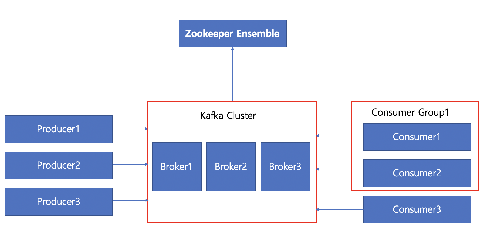
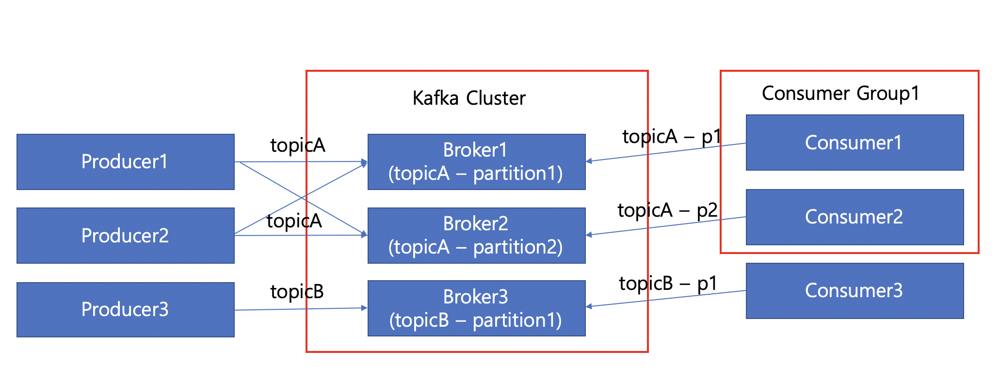
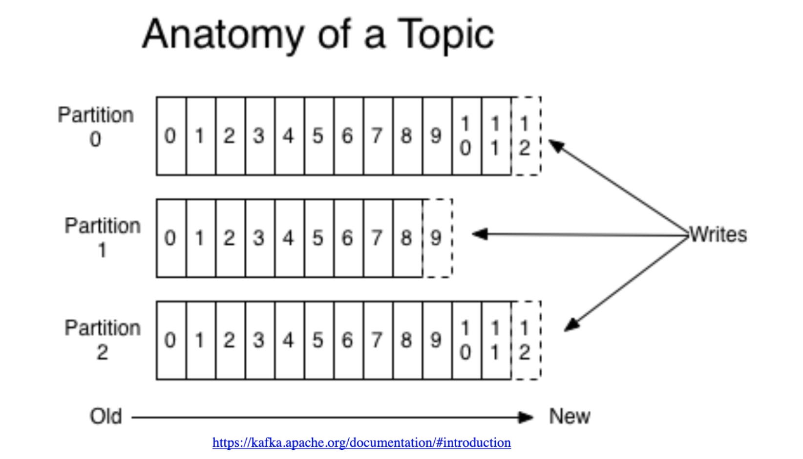
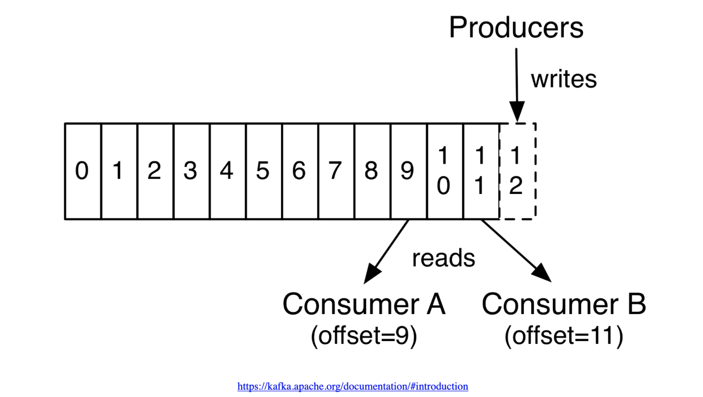
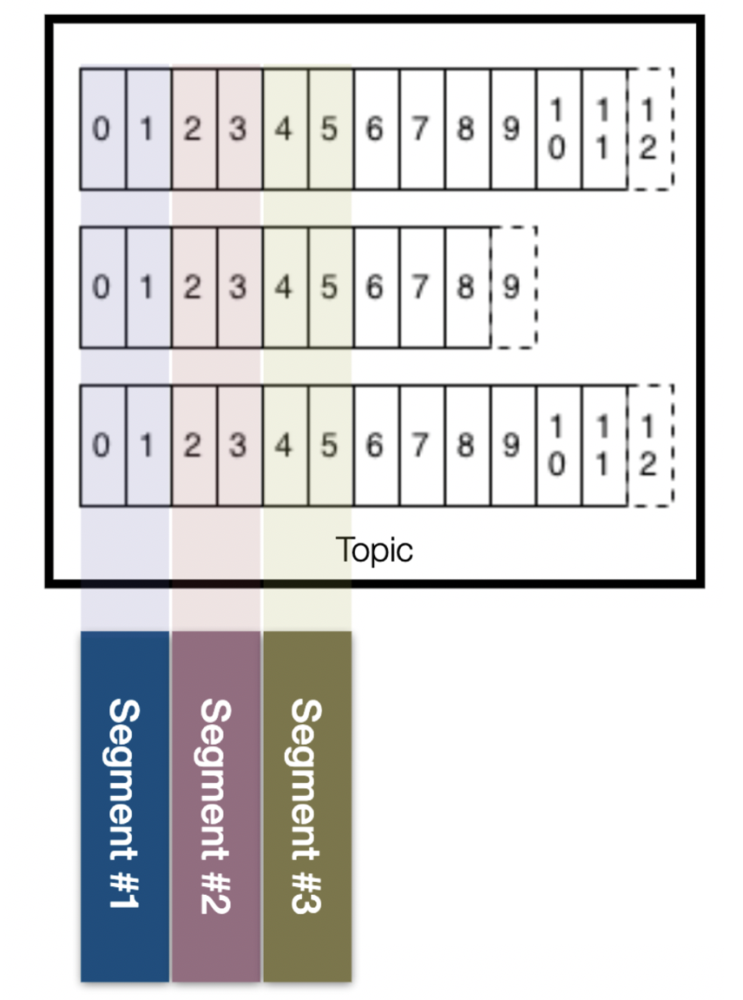
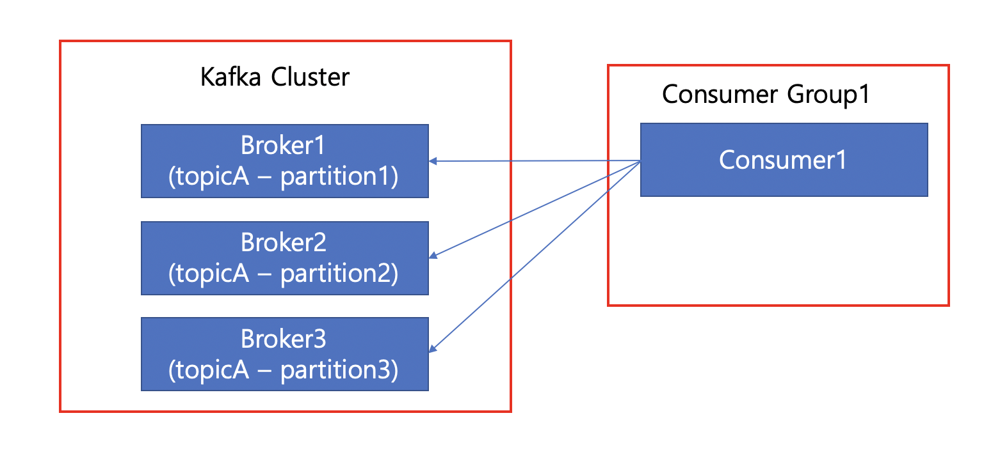
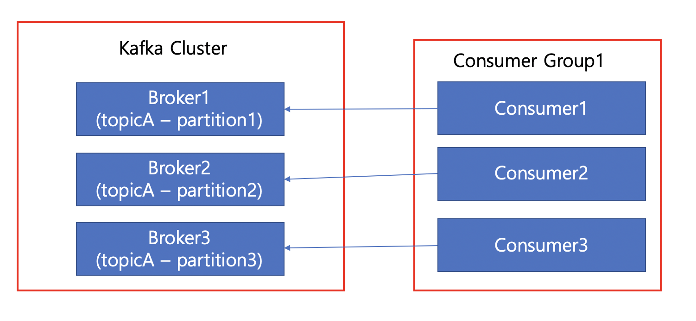
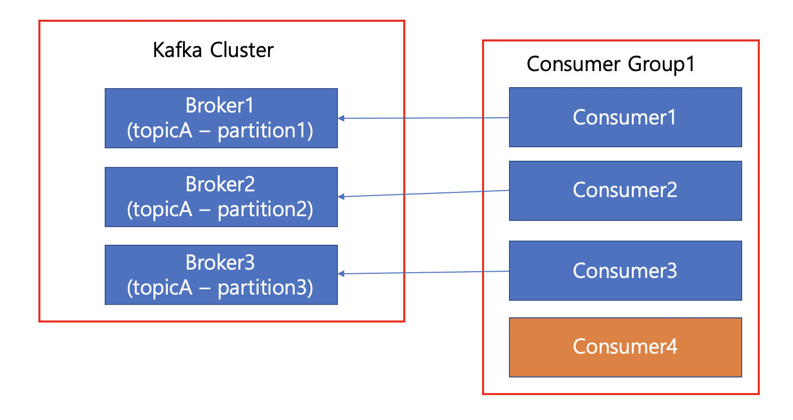
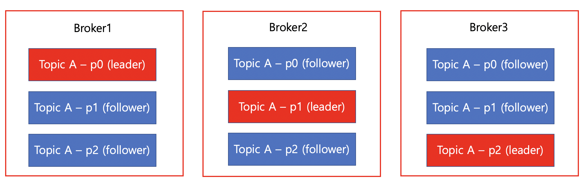

# Apache Kafka

Aphache Kafka는 하루에 수 조개의 이벤트를 처리할 수 있는 `분산 이벤트 스트리밍 플랫폼`입니다. 대용량에서 특히 빠른 처리 속도를 보여 빠른 처리 속도가 필요한 서비스에서는 Kafka를 필수적으로 사용하고 있습니다.
분산 이벤트 스트리밍 플랫폼이란, 하나의 이벤트가 발생했을 때 해당 이벤트를 동시에 여러 서비스에 포워드 해주는 플랫폼이라고 이해하시면 됩니다.

ex) 거래가 발생했을 때, 거래내역이 필요한 모든 서비스에 거래내역을 뿌려주는 플랫폼.

## Kafka 기본 구조

Kafka는 크게 Producer, Kafka Cluster, Consumer 이렇게 세 그룹으로 나뉘게 됩니다. Producer는 Kafka Cluster에 메시지(이벤트)를 카프카에 넣는 역할을 수행하고, Consumer는 Kafka Cluster에서 메시지(이벤트)를 가져오는 역할을 수행합니다. Producer는 `독립`적으로 카프카 클러스터에 데이터를 전달할 수 있다는 점이 주요한 특징 중 하나입니다. 프로듀서와 달리 컨슈머는 `그룹`을 이루어 메시지를 읽을 수 있고, 큐에 쌓여있는 데이터 중 자신이 필요한 데이터만을 가져와 읽을 수 있다는 특징이 있습니다. 컨슈머가 어떻게 자신이 원하는 데이터만을 읽을 수 있는지에 대해서는 `Topic`을 이용하기 때문인데, Topic에 대해서는 뒤에서 좀 더 자세히 살펴보기로 합니다. 여기서는 **Producer는 각 컴포넌트가 `독립`적으로 메시지를 생성하여 저장하고, Consumer는 `그룹`을 이루어 메시지를 읽는다.**는 사실만 기억하도록 합시다.

Kafka Cluster는 메시지를 저장하는 메시지 큐 역할을 수행합니다. 카프카 클러스터 내에는 여러 개의 브로커로 이루어져 있습니다. **브로커는 메시지(이벤트)를 저장하는 서버**로 메시지가 들어왔을 때 메시지를 분산하여 저장하도록 되어있습니다. Zookeeper는 카프카 클러스터에 대한 메타데이터를 저장하고, 관리하는 역할을 수행하기 때문에 Kafka를 이용하기 위해서는 반드시 함께 설치되어야 합니다. 추후에는 둘의 의존성을 제거하고 하나로 합쳐질 것으로 보여, 자세한 설명은 생략합니다. (저도 잘 모릅니다.)

## Topic

Broker는 메시지(이벤트) 별로 구분하기 위해 `Topic` 별로 메시지를 나누어 저장하도록 되어있습니다. Producer는 메시지를 전달할 때 어떤 topic에 메시지를 저장할 지에 대해서 명시해서 저장해야 합니다. 같은 이유로 Consumer 또한 어떤 topic에서 데이터를 읽을 지 명시해서 읽게 됩니다.

그림에선 Producer1, Producer2는 TopicA에 데이터를 저장하고 있고, Consumer Group1은 TopicA에 대한 데이터를 읽고 있습니다. 이 부분에 대해서 좀 더 자세히 살펴봅시다. Producer1, Producer2는 TopicA에 메시지를 보낸다고 명시만 할 뿐, 어떤 브로커(파티션)에 메시지를 저장할 지는 적절한 규칙이나 hash함수를 적용해서 내부적으로 결정하게 됩니다.

파티션이란, **메시지를 저장하는 논리적 파일**입니다. Kafka Cluster는 TopicA에 대한 메시지를 몇 개의 파티션으로 나누어 저장할 것인지를 사전에 정의합니다.

Consumer는 Producer와 마찬가지로 TopicA에 대한 메시지를 읽겠다고만 명시합니다. 현재 Consumer Group1에 2개의 Consumer가 존재하므로 Consumer1은 partition1에서 데이터를 읽어오고, Consumer2는 partition2에서 데이터를 읽어오도록 자동으로 설정됩니다. 만약 Consumer가 1개로 이루어져있다면, Consumer는 모든 파티션에서 데이터를 읽어옵니다.

> 반대로 파티션의 수가 3개일 때, Consumer Group의 Consumer 수가 4개 이상이라면, 3개를 제외한 나머지 Consumer는 할당받은 partition이 없어 놀게 됩니다.

> 파티션이 File System이면 파일에 대한 입출력이 발생할텐데, 그럼에도 불구하고 Kafka의 성능이 빠른 이유는 파일을 메모리에 올려두고 사용하기 때문입니다. 따라서, Kafka를 사용하는 서버는 다른 작업과 함께 쓰여서는 안되고, Kafka 프로세스만 띄워놓고 사용하는 것이 성능상 유리합니다.

## Partition

파티션은 앞서 얘기한 것처럼 **논리적 파일**입니다. 각 파티션은 고유한 **offset(메시지의 저장 위치)**을 가지고 있고, 메시지가 추가될 때마다 맨 뒤에 메시지가 붙는 `Append-only` 파일이라고 이해하시면 편합니다. 즉, Partition0에서 메시지가 추가될 경우 12번 offset에 메시지가 추가되는 형태입니다.

Consumer가 해당 파티션을 읽는 경우에는 0번 offset부터 순서대로 읽기 때문에 하나의 파티션에서는 메시지의 순서가 보장된다는 특징이 있습니다. 또 재미있는 특징으로는 하나의 topic을 컨슈머그룹A, 컨슈머그룹B에서 읽는 경우에는 두 그룹이 어디까지 데이터를 읽었는지가 따로 관리가 됩니다. 즉, A그룹이 메시지를 읽었다고 해서 B그룹에서 해당 메시지를 못 읽는 구조가 아닙니다. 이러한 특징 때문에 Kafka가 훌륭한 Data-pipeline이라고 불리기도 합니다.

또, 컨슈머그룹A에 Consumer가 여러 개 구성되어있을 때에 각 컨슈머는 하나의 파티션을 같이 사용할 수 없다는 특징도 있습니다. 만약 컨슈머 그룹A에 있는 Consumer1, Consumer2가 같은 Partition1을 바라보고 있다면 Race condition이나 여러 조건들을 고려해야 하고, 이런 고비용 작업에 비해 얻는 장점이 매우 적기 때문에 지원하지 않는 것이 타당해 보입니다.

> 하나의 파티션에서 데이터를 읽을 때에는 순서가 보장되지만, 하나의 토픽이 여러 개의 파티션으로 이루어져있다면 순서를 보장받을 수 없습니다.

## Segment

하나의 파티션은 **Segement라는 물리적 파일**로 나뉘어서 데이터가 저장됩니다. 세그먼트는 시간 또는 크기 기준으로 닫히게 되며, 세그먼트가 닫힌 이후 일정 시간이 지나면 삭제하도록 되어있습니다.

> 세그먼트의 크기, 삭제 시간 등은 전부 Custom하게 설정이 가능합니다.

## Consumer Group

하나의 컨슈머에서 topicA에 대한 모든 partition을 읽어와 처리할 수 있습니다. 아무런 설정없이 서버가 1대일 경우 위의 이미지처럼 동작합니다. 프로듀서의 성능에 비해 컨슈머의 속도가 느릴 경우 Consumer 그룹에 서버를 추가하기만 하면 되므로 확장에 매우 용이합니다.

같은 그룹에 속한 컨슈머들은 서로 같은 파티션을 바라볼 수 없습니다. 3개의 파티션에 3개의 컨슈머가 있을 경우, 각 컨슈머는 하나의 파티션을 담당하여 메시지를 읽어들이게 됩니다.

만약 Consumer에 장애가 발생하는 경우에는 **리밸런스**가 이루어져, 나머지 컨슈머에서 2개의 파티션을 처리하도록 변경됩니다.

파티션의 수보다 컨슈머의 수가 많은 경우입니다. 이 경우에는 Consumer4는 아무런 일도 수행하지 않습니다. 이와 같은 구성은 잘못된 구성방법입니다.

## Replica

리플리카는 복제본이라는 의미입니다. Kafka와 같이 분산 시스템인 경우에는 데이터를 나누어서 저장하고 있기 때문에 하나의 서버가 죽었을 때에도 HA를 위해(서비스에 장애가 발생하지 않도록) 복제본을 만들어두는 것이 일반적입니다.

위의 그림은 3개의 파티션에 3개의 Replica를 설정한 그림입니다. **Kafka Client와 데이터를 주고 받는 파티션을 리더 파티션**이라고 부르며, **복제되어있는 파티션을 팔로워 파티션**이라고 부릅니다. 리더 파티션에 장애가 발생했을 경우 팔로워 파티션 중 하나를 리더로 선발하여 HA를 보장합니다.

### 복제 시점

Message에 대한 복제 시점 또한 매우 중요합니다. 만약, 리더 파티션에만 메시지가 저장되어있고 복제가 되어있지 않은 상태에서 브로커에 장애가 발생한다면, 새로 선발된 리더는 해당 메시지를 알지 못하기 때문에 데이터 누락이 발생할 수 있습니다. 이런 데이터 누락이 발생해도 괜찮은 서비스라면 문제없지만(실시간 GPS 정보 동기화), 결제와 같은 금융 서비스에서는 데이터 누락이 매우 치명적일 수 있습니다.

**리더 파티션과 팔로워 파티션이 완벽하게 동일한 데이터를 가지고 있을 때를 ISR(In-Sync Replica)**라고 부르며, ISR인 상태에서만 리더를 선출하고 싶다면 `unclean.leader.election.enable=false`로 설정해주시면 됩니다.

