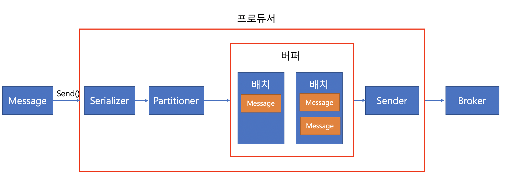

# Kafka Producer

## 의존성 주입

Kafka broker 버전에 따라서 Kafka Client 의존성 버전에 이슈가 있는 경우가 있습니다. Kafka broker 1.0 이상의 버전에서는 Kafka Client의 모든 버전을 지원하므로 너무 낮은 버전의 사용은 지양하는 것이 좋습니다.

```
dependencies {
 compile group: 'org.apache.kafka', name: 'kafka-clients', version: '2.5.0'
}
```

## 예제 코드

```java
Properties prop = new Properties();
prop.put("boostrap.servers", "kafka01:9092,kafka02:9092,kafka03:9092");                 //카프카 클러스터 정보
prop.put("key.serializer", "org.apache.kafka.common.serialization.StringSerializer");   //메시지 Key Serializer
prop.put("value.serializer", "org.apache.kafka.common.serialization.StringSerializer"); //메시지 Value Serializer

// prop.put((ProducerConfig.BOOTSTRAP_SERVERS_CONFIG, "kafka01:9092,kafka02:9092,kafka03:9092");
// prop.put((ProducerConfig.KEY_SERIALIZER_CLASS_CONFIG, StringSerializer.class.getName());
// prop.put((ProducerConfig.VALUE_SERIALIZER_CLASS_CONFIG, StringSerializer.class.getName());

KafkaProducer<Integer, String> producer = new KafkaProducer<>(prop);

producer.send(new ProducerRecord<>("topicname", "key", "value"));                       //topic, key, value
producer.send(new ProducerRecord<>("topicname", "value"));                            //topic, value

producer.close();
```

프로듀서는 2개의 send 메서드를 지원하고 있으며, `key`에 대한 값을 넘겨주는 메서드와 아닌 메서드가 있습니다. key는 메시지를 식별하고 싶은 경우에 사용할 수 있습니다.

- boostrap.servers : 카프카 클러스터에 연결하기 위한 브로커 목록
- key.serializer : 메시지 키 직렬화에 사용되는 클래스
- value.serializer : 메시지 값 직렬화에 사용되는 클래스

- acks : 레코드 전송 신뢰도 조절 (레플리카)
- compression.type : snappy, gzip, lz4 중 하나로 압축하여 전송
- retries : 클러스터 장애에 대응하여 메시지 전송을 재시도하는 횟수
- buffer.memory : 브로커에 전송될 메시지의 버퍼로 사용될 메모리 양
- batch.size : 여러 데이터를 함께 보내기 위한 레코드 크기
- linger.ms : 현재의 배치를 전송하기 전까지 기다리는 시간
- client.id : 어떤 클라이언트인지 구분하는 식별자

위의 세 개의 속성은 프로듀서를 이용하기 위해서 반드시 필요한 설정이고, 아래의 것들은 자주 사용되는 선택옵션들입니다. 아래의 옵션들에 대해서는 하나씩 살펴봅시다.

## 프로듀서 Flow



1. KafkaProducer::send 메서드를 호출합니다.
2. KafkaProducer에 설정해두었던 Serializer를 통해 Key와 Value를 직렬화합니다. (byte 배열로 변환)
3. 직렬화된 메시지를 Partitioner를 통해 어떤 브로커에 전달할 지 결정합니다. (라운드 로빈, hash(key) 등)
4. 결정이 된 메시지는 버퍼의 배치에 데이터가 적재됩니다. (서로 다른 파티션의 메시지는 서로 다른 배치에 적재됩니다.)
5. Sender는 별도의 쓰레드로 동작하며, 주기적으로 배치에 있는 메시지를 브로커로 전송합니다.

> Sender가 별도의 쓰레드로 동작하기 때문에 데이터를 보내는 동안에도 배치에는 메시지가 꾸준히 쌓이게 됩니다.

### 처리량 관련 옵션

batch.size : 배치 크기를 의미합니다. 배치 크기가 다 차면 데이터가 바로 전송됩니다. 만약, batch.size를 너무 작게 두는 경우 메시지를 많이 모아서 전송하지 못하기 때문에 전송 횟수가 늘게 된다는 단점이 있습니다.
linger.ms : Sender가 배치를 브로커에게 전송하고 얼만큼 대기할 지를 의미합니다. 이 값은 default 0으로 설정되어있고 이것의 의미는 배치를 전송한 다음 바로 다음 배치를 전송한다는 것을 의미합니다. linger.ms를 100ms 정도로 주는 경우에는 100ms 동안 배치에 메시지들을 모아서 전송할 수 있기 때문에 더 높은 처리량을 기대할 수 있습니다.

## 전송 결과 확인

```java
Future<RecordMetaData> f = producer.send(new ProducerRecord<>("topic", "value"));
try {
    RecordMetadata meta = f.get(); //blocking
} catch (ExecutionException ex) {

}
```

Future를 이용하여 메시지의 전송 유무를 확인합니다. 여기서 말하는 전송은 브로커까지 메시지가 전달되는 것을 의미합니다. 이 방법은 메시지를 보낼 때마다 blocking이 되므로 API의 성능에 영향을 끼칠 수 있습니다.

```java
producer.send(new ProducerRecord<>("topic", "value"), new Collback() {
    @Override
    public void onCompletion(RecordMetaData metadata, Exception e) {
        log.info("[KAFKA PRODUCER - TOPIC] Success to produce.");
    }
})
```

Callback을 이용하는 경우 처리량 저하를 발생시키지 않습니다. 실패했을 경우에는 Exception에 예외에 대한 내용이 들어갑니다.

### ACKs 옵션

ACKs 옵션은 **어떤 시점을 데이터 전송의 성공**으로 볼 것인지에 대한 옵션입니다. ACKs로 설정한 값에 따라서 데이터가 유실될 수도 있고 성능이 떨어질 수도 있으므로 주의 깊게 설정해야 합니다.

ACKs = 0은 서버의 응답을 기다리지 않는 옵션입니다. 즉, 데이터 전송에 실패하더라도 알 수가 없으며 데이터가 유실될 수 있습니다. 한 번쯤 데이터가 유실되어도 상관없는 경우에는 이런 설정이 유용합니다.
ACKs = 1은 리더 파티션에 데이터가 적재되는 경우 성공을 응답합니다. 리더 파티션에 장애가 발생했을 때 ISR을 보장할 수 없기 때문에 데이터 유실이 발생할 수 있습니다.
ACKs = all은 모든 리플리카에 메시지가 저장되었을 때 성공을 응답합니다. 결제 데이터처럼 단 한 번의 유실도 있어서는 안될 경우에 주로 사용합니다. 이 값은 브로커 min.insync.replicas 값을 설정함으로써 팔로워 노드 1개에 정상적으로 복제된 경우 성공으로 응답하도록 설정할 수 있습니다.

> 리플리카 개수 3, acks = all, min.insync.replicas = 2인 경우 리더에 적재되고 1개의 팔로워 파티션에 저장이 되면 성공을 응답하게 됩니다.
> 리플리카의 개수 3, acks = all, min.insync.replicas = 3으로 설정하는 경우에는 브로커 1대에 장애가 발생했을 때 min.insync.replicas를 만족할 수가 없으므로 모든 메시지 프로듀싱이 실패하게 됩니다. 따라서 min.insync.replicas는 적절한 값으로 설정해야 합니다.

## 에러 유형

### 전송 과정 에러

- 전송 타임 아웃(일시적인 네트워크 오류 등)
- 리더 다운에 의한 새 리더 선출 진행 중
- 브로커 설정 메시지 크기 한도 초과

### 전송 전에 실패

- 직렬화 실패, 프로듀서 자체 요청 크기 제한 초과
- 프로듀서 버퍼 대기 시간 초과 (버퍼가 가득 찬 경우)

### 실패 대응 방법 : 재시도

브로커 응답 타임아웃, 일시적인 리더 없음 등의 경우에는 재시도를 하는 것이 바람직한 대응입니다. 프로듀서는 자체적으로 브로커 전송 과정에서 에러가 발생하면 재시도 가능한 에러에 대해서는 재전송을 시도합니다. 
send() 메서드에서 익셉션 발생 시에는 send()를 재호출하거나 콜백 메서드에서 예외에 따라 재호출하도록 코드를 구현할 수도 있습니다. 

여기서 주의할 점은 **무한히 재시도를 해서는 안됩니다.** 재시도를 무한히 하는 경우 다른 메시지를 전송하지 못하고 busy한 상태가 되기 때문에 재시도 횟수를 정의해두고 사용합니다. 재시도 횟수를 정의하는 옵션은 `retries` 옵션입니다.

> 재시도는 굉장히 편리한 대응 방법으로 보이지만, 데이터가 중복해서 저장될 가능성이 있습니다. 데이터가 성공적으로 저장되었지만 브로커로부터 응답이 늦게 도착하여, 재시도를 하는 경우 데이터가 2건 저장될 수 있습니다. enable.idempotence 속성을 이용하면 중복 저장되는 경우를 줄일 수 있다고 합니다. 이 외에도 MessageKey, MessageId 등으로 중복된 메시지가 도착하는 경우 메시지를 무시하도록 설정할 수도 있습니다.

> max.in.flight.requests.per.connection 속성은 하나의 커넥션에서 전송할 수 있는 최대 배치 개수를 의미합니다. 즉, 이 값이 3이라면 한 번에 3개의 배치가 브로커로 전송될 수 있습니다. 만약 이 값이 3으로 설정되어있는데 데이터 전송에 실패하여 재시도를 하는 경우에는 메시지의 순서가 달라질 수도 있습니다.

### 실패 대응 방법 : 기록

별도 파일, DB 등을 이용해서 실패한 메시지를 기록하는 방법도 있습니다. DB에 저장해두고 실패한 메시지에 대해서 재전송을 한다면 데이터의 유실없이 처리할 수 있습니다.
send() 메서드에서 Exception이 발생했을 때 DB에 데이터를 저장하면 됩니다.


