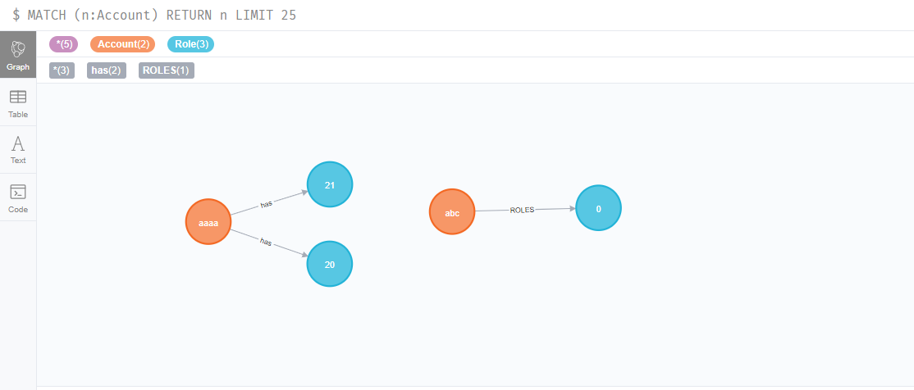

## 인메모리 데이터 베이스 H2

인메모리 데이터베이스는 `H2`, `HSQL`, `Derby` 세 가지가 있다. 콘솔의 기능이 있는 H2가 그나마 사용하기 좋다.

Dependency로 `web`, `JDBC`, `H2`를 추가하자.

pom.xml에는 다음과 같은 의존성이 추가된다.

```xml
<dependency>
    <groupId>org.springframework.boot</groupId>
    <artifactId>spring-boot-starter-jdbc</artifactId>
</dependency>
<dependency>
    <groupId>com.h2database</groupId>
    <artifactId>h2</artifactId>
    <scope>runtime</scope>
</dependency>
```

### DataSource, JdbcTemplate

스프링 부트는 `Spring-JDBC`가 클래스 패스에 존재하면 `DB`와 관련된 빈들을 자동설정 해준다. 자동등록되는 빈 중에서 가장 대표적인 빈 두 개가 `DataSource`와 `JdbcTemplate` 이다.

- `DataSource`는 커넥션 풀을 관리하는 객체인데, 자동으로 `HikariDataSource`를 등록해주는 것으로 보인다.
- `JdbcTemplate`은 지저분한 `JDBC API`를 좀 더 사용하기 쉽게 템플릿을 제공한다. 따라서 개발자는 Connection 생성,소멸 등을 관리할 필요가 없어진다.

### h2 콘솔 허용

h2 콘솔을 사용하기 위해서는 `spring-dev-tools` 의존성을 추가하거나, `spring.h2.console.enabled=true`로 설정해주면 된다. 설정이 끝나면, `/h2-console`로 데이터베이스를 확인할 수 있다.

- 커넥션에 대한 정보를 얻고 싶은 경우

```java
connection.getMetaData().getURL();
connection.getMetaData().getUserName();
```

### 사용 예시

`JdbcTemplate`이 제공하는 기능을 한 눈에 살펴보기 위해, 테이블을 생성할 때에는 `JDBC API`를 이용하여 작성했다. `JDBC API`를 이용하는 경우 반드시 커넥션을 잘 닫아줘야 한다. 코드가 길어지므로 여기서는 생략했다.

**예제 코드**

```java
@Component
public class H2Runner implements ApplicationRunner {

	@Autowired
	DataSource dataSource;

	@Autowired
	JdbcTemplate jdbcTemplate;
	SimpleJdbcInsert simpleJdbcInsert;

	@Override
	public void run(ApplicationArguments args) throws Exception {

        // 기존의 JDBC API. 추가적으로 try/catch를 이용해 예외 발생에 대한 처리를 해야 한다.
		Connection connection = dataSource.getConnection();
		System.out.println(connection.getMetaData().getURL());
		System.out.println(connection.getMetaData().getUserName());
		Statement statement = connection.createStatement();
		String sql = "CREATE TABLE USER(ID INTEGER NOT NULL, NAME VARCHAR(255), PRIMARY KEY(id))";
		statement.executeUpdate(sql);
		statement.close();
		connection.close();

        // Spring jdbc에서 제공하는 JdbcTemplate을 이용하면 반복되는 작업을 작성하지 않을 수 있다.
		jdbcTemplate.update("INSERT INTO USER VALUES(?,?)", 1, "name");

        // SimpleJdbcInsert는 insert문을 작성하지 않도록 도와준다. 생성시 단순히 테이블을 지정하고, 값을 넣어줄 컬럼 또는 자동으로 넣어줄 컬럼을 선택하면 된다.
		simpleJdbcInsert = new SimpleJdbcInsert(dataSource).withTableName("USER");
		simpleJdbcInsert.execute(new MapSqlParameterSource().addValue("id", 5).addValue("name", "Youngjae"));
	}
}
```

<br><hr>

## DBCP

`DBCP(Database Connection Pool)`를 지원하는 제품은 `HikariCP`, `Tomcat CP`, `Commons DBCP2` 정도가 있다. 스프링 부트는 `HikariCP`를 default로 설정하고 있다.

DBCP에 대한 설정을 추가하고싶다면, `application.properties`에 `spring.datasource.hikari.*` 값을 수정하면 된다. 각 프로퍼티들이 갖는 정보는 공식문서를 참고하는 편이 좋다.

[hikari](https://github.com/brettwooldridge/HikariCP#frequently-used)

조금만 더 첨언하자면, 커넥션은 CPU 코어의 개수만큼 동시 실행이 가능하다. 이를 고려하여 maximum-pool-size를 결정하자.

## Mysql 사용하기

Mysql을 사용하기 위해서는 먼저 Mysql에 접속할 수 있도록 도와주는 커넥터를 설치해야한다.

- 의존성 추가

```xml
<dependency>
   <groupId>mysql</groupId>
   <artifactId>mysql-connector-java</artifactId>
</dependency>
```

### 계정 생성

의존성 추가가 끝났으면, 사용하고자 하는 데이터베이스와 데이터베이스에 접근이 가능한 계정을 만들어 주어야 한다.

- 계정 생성 방법. '%'는 외부에서의 접속을 허용하는 설정입니다.

```sql
create user id@localhost identified by password;
create user id@'%' identified by password;
```

- 권한 부여 방법

```sql
grant all privileges db이름.테이블이름 to id;
```

### DB property 설정하기

DB 로그인 관련 프로퍼티 application.properties에 설정한다.

```properties
spring.datasource.hikari.maximum-pool-size=8
spring.datasource.url=jdbc:mysql://localhost:3306/springdb?serverTimezone=UTC
spring.datasource.username=yjhn0715
spring.datasource.password=1234
```

- property에 `Driver`를 명시하지 않는 이유는, Spring boot가 url을 참고하여, `Mysql Driver`를 사용한다.

**예제 코드**

```java
@Component
public class MysqlRunner implements ApplicationRunner {

	@Autowired
	DataSource dataSource;

	@Autowired
	JdbcTemplate jdbcTemplate;

	@Override
	public void run(ApplicationArguments args) throws Exception {
		System.out.println(dataSource.getClass());	//HikariDataSource

//		jdbcTemplate.execute("CREATE TABLE `USER`(\r\n" +
//				"	seq BIGINT(10) NOT NULL AUTO_INCREMENT,\r\n" +
//				"	id VARCHAR(20) NOT NULL UNIQUE,\r\n" +
//				"	name VARCHAR(10),\r\n" +
//				"	PRIMARY KEY (`seq`),\r\n" +
//				"	UNIQUE KEY uniq_key(`id`)\r\n" +
//				");");

		jdbcTemplate.update("DELETE FROM USER");
		jdbcTemplate.update("INSERT INTO USER(id,name) VALUES(?,?)",
				 "pjok1122", "yj");
		jdbcTemplate.update("INSERT INTO USER(id,name) VALUES(?,?)",
				"yjhn0715", "yjhn");

		User user = jdbcTemplate.queryForObject("SELECT * FROM USER WHERE id=?",
				new BeanPropertyRowMapper<User>(User.class), "pjok1122");
		System.out.println(user);	//User [seq=10, id=pjok1122, name=yj]
	}
}
```

**docker 코드**

Mysql이 없는 경우 도커를 이용하면 편리하다.

```docker
docker run -p 3306:3306 --name mysql_boot -e MYSQL_ROOT_PASSWORD=1 -e MYSQL_DATABASE=springdb -e MYSQL_USER=yjhn0715 -e MYSQL_PASSWORD=1234 -d mysql
```

Mysql 라이센스(GPL) 는 소스 코드 공개의 의무가 있다. 따라서 Mysql보단 MariaDB를 사용하자. 사용 방법은 동일하다. docker 생성 시, `-d mysql`을 `-d mariadb`로만 변경한다.

- 사실 `mariadb`보다도 `PostgreSQL`을 사용하는게 낫다.

<br><hr>

## PostgreSQL

위와 내용이 겹치는 부분이 많으므로 설명은 생략.

### Docker

```
컨테이너 생성
docker run -p 5432:5432 -e POSTGRES_PASSWORD=pass -e POSTGRES_USER=yjhn0715 -e POSTGRES_DB=springdb --name postgres_boot -d postgres

docker exec -i -t postgres_boot bash

su - postgres
psql springboot

윈도우에서는 이 명령어로 해야함.
psql --username=yjhn0715 --dbname=springdb

데이터베이스 조회
\list

테이블 조회
\dt

쿼리
SELECT * FROM account;
```

### 의존성 및 프로퍼티 설정

- Postgre Driver 의존성 추가

```xml
<dependency>
	<groupId>org.springframework.boot</groupId>
	<artifactId>spring-boot-starter-jdbc</artifactId>
</dependency>
<dependency>
	<groupId>org.springframework.boot</groupId>
	<artifactId>spring-boot-starter-web</artifactId>
</dependency>

<dependency>
	<groupId>org.postgresql</groupId>
	<artifactId>postgresql</artifactId>
	<scope>runtime</scope>
```

- 프로퍼티 설정

```properties
spring.datasource.hikari.maximum-pool-size=8
spring.datasource.url=jdbc:postgresql://localhost:5432/springdb
spring.datasource.username=yjhn0715
spring.datasource.password=pass
```

**예제 코드**

```java
@Component
public class PgRunner implements ApplicationRunner {

	@Autowired
	JdbcTemplate jdbcTemplate;

	@Override
	public void run(ApplicationArguments args) throws Exception {
		System.out.println(jdbcTemplate.getDataSource().getClass());
		System.out.println(jdbcTemplate.getDataSource().getConnection().getMetaData().getDriverName());


		jdbcTemplate.execute("CREATE TABLE account(id INTEGER NOT NULL, name VARCHAR(255), PRIMARY KEY(id))");
		jdbcTemplate.update("INSERT INTO account VALUES(?,?)", 1, "yj");
		jdbcTemplate.update("INSERT INTO account VALUES(?,?)", 2, "hani");
	}

}
```

- 생성된 테이블과 튜플들은 터미널에서도 확인할 수 있지만, `dbeaver`와 같은 `DB 클라이언트 소프트웨어`를 이용하는 것이 더 편리하다.

<br><hr>

## Spring Data JPA

스프링 데이터 JPA는 `객체`와 `릴레이션`을 맵핑할 때 발생하는 개념적 불일치를 해결하는 프레임워크라고 할 수 있다. 여기서 말하는 개념적 불일치의 예로는 `객체의 equal 메서드`와 `릴레이션의 equal`의 차이라던가, `릴레이션`에 존재하는 `Key`를 `객체`에서는 어떻게 나타낼 것인가 등 많은 문제점이 있다.

- JPA는 `ORM(Object Relational Mapping)`을 위한 Java EE 표준이다.

- 스프링 데이터 JPA는 `Repository` 빈을 자동으로 생성해주며, 쿼리 메서드 또한 자동으로 구현해준다. 따라서 간단한 쿼리의 경우에는 개발자가 직접 작성할 필요가 없다.

- 스프링부트를 사용하는 경우에는 `@EnableJpaRepositories`을 자동으로 설정해주기 때문에 추가 설정할 내용이 없다.

- Spring Data JPA는 JPA를 사용하여 동작하고, JPA는 `hibernate`의 구현체다. hibernate는 내부적으로 DataSource를 사용하고 있으니, 결국은 JDBC의 모든 기능을 사용한다고 볼 수 있다.

### Spring Data JPA 사용하기

- 의존성 추가

```xml
<dependency>
<groupId> org.springframework.boot </groupId>
<artifactId> spring-boot-starter-data-jpa </artifactId>
</dependency>
```

- @Entity 클래스 만들기

```java
@Entity
public class Account {
	@Id @GeneratedValue
	private long id;
	private String username;
	private String password;

	//Getter & Setter & Constructor
	//equals & hashCode
}
```

- Repository 만들기

```java
public interface AccountRepository extends JpaRepository<Account, Long>{
	Account findByUsername(String username);
}
```

JpaRepository`<Entity, id>`를 상속하여 구현한다. 인터페이스 내에 `findByUsername`과 같은 메서드를 정의해두면, Spring Data JPA가 자동으로 구현해준다.

- DB 설정 (위와 동일하게 `properties`를 작성하면 된다.)

```properties
spring.datasource.hikari.maximum-pool-size=8
spring.datasource.url=jdbc:postgresql://localhost:5432/springdb
spring.datasource.username=yjhn0715
spring.datasource.password=pass
```

**예제 코드**

테스트 코드에서 데이터베이스를 사용하면, DB에 반영되는 문제점이 발생할 수 있다. 따라서 `properties` 파일을 Test 폴더에 새로 정의하거나, 슬라이스 테스트를 하는 것이 좋다. **슬라이스 테스트를 하는 경우에는 반드시 인메모리 데이터베이스를 사용해야 한다.**

```java
@RunWith(SpringRunner.class)
@DataJpaTest
public class AccountTest {
	@Autowired
	AccountRepository accountRepository;

	@Test
	public void di() {
		Account account = new Account();
		account.setUsername("yjhn0715");
		account.setPassword("1234");

		Account saveAccount = accountRepository.save(account);
		assertThat(saveAccount).isNotNull();

		Account existingAccount = accountRepository.findByUsername(saveAccount.getUsername());
		assertThat(existingAccount).isNotNull();
	}
}
```

JPA는 자세히 다뤄야 할 내용이 많으므로 별도의 깃헙 repo에 정리할 예정.

<br><hr>

## Spring에서 JPA 초기화

Spring은 Entity 스캔을 통해 `@Entity` 애노테이션이 붙은 클래스를 찾는다. 만약 `spring.jpa.generate-ddl=true`라고 설정되어있다면, `DDL(Data Define Language)`을 작성하여 DB에 적용한다.

`DDL`에는 다양한 옵션을 줄 수 있다. `spring.jpa.hibernate.ddl-auto`를 설정하면 된다.

- `none` : 아무것도 실행하지 않는다.
- `create` : 기존에 있는 테이블을 drop하고 새로운 테이블을 만든다.
- `update` : 테이블에 변경 사항이 있을 경우 이를 반영한다. 단, 컬럼의 이름이 변경된 경우 스키마에는 변경 전 컬럼과 변경 후 컬럼이 모두 남게 된다.
- `validate` : 운영모드에 주로 사용하는 옵션으로, `@Entity`와 현재 스키마가 일치하는지 확인한다. 차이가 있다면 애플리케이션 종료.

_cf)어떤 테이블이 생성되었는지 확인하고 싶다면 `spring.jpa.show-sql=true`로 설정한다._

### SQL Script

Spring은 기본 값으로 classpath 루트에 `schema.sql`, `schema-{platform}.sql`이 있으면 서버 시작 시 이 sql을 실행한다. 따라서 `schema.sql`에 DDL을 작성하고, `data.sql`에 `DML(Data Manipulation Language)`를 작성하는 방법도 있다.

- `DML`에 한글이 들어가는 경우, 스크립트가 깨질 수 있으므로, `spring.datasource.sql-script-encoding=UTF-8`로 설정한다.

- initalization을 허용하는 프로퍼티인 `spring.datasource.initialization-mode`도 always로 변경한다.

**예제 코드**

```properties
spring.datasource.hikari.maximum-pool-size=8
spring.datasource.url=jdbc:postgresql://localhost:5432/springdb
spring.datasource.username=yjhn0715
spring.datasource.password=pass

spring.jpa.generate-ddl=false
spring.jpa.hibernate.ddl-auto=validate

spring.jpa.show-sql=true
spring.datasource.sql-script-encoding=UTF-8
spring.datasource.initialization-mode=always

```

<br><hr>

## 데이터 마이그레이션

DB 마이그레이션 툴로 가장 많이 사용되는 제품은 `Flyway`와 `Liquibase`가 있다. DB 마이그레이션 툴은 `DB 스키마`와 `데이터`를 버전 관리할 수 있도록 도와주는 툴이다.

### Flyway 살펴보기

- flyway를 사용하기 위해서는 가장 먼저 의존성을 추가해줘야 한다.

```xml
<dependency>
	<groupId>org.flywaydb</groupId>
	<artifactId>flyway-core</artifactId>
</dependency>
```

- 마이그레이션 디렉터리 생성

`src/main/resources` 밑에 `/db/migration` 또는 `/db/migration/{vendor}` 폴더를 생성한다. 이 값은 `spring.flyway.locations` 프로퍼티를 이용하여 변경이 가능하다.

- 마이그레이션 파일 이름

마이그레이션 파일 이름은 반드시 `V2__init.sql`, `V3__add_active.sql`과 같은 형태로 작성해야 한다. (첫글자는 반드시 `V`, 버전은 순차적으로, 버전과 내용 사이에는 `__` 언더바 두개 사용.)

- properties 설정

```properties
spring.datasource.hikari.maximum-pool-size=8
spring.datasource.url=jdbc:postgresql://localhost:5432/springdb
spring.datasource.username=yjhn0715
spring.datasource.password=pass

spring.jpa.generate-ddl=false
spring.jpa.hibernate.ddl-auto=validate

spring.jpa.show-sql=true
spring.datasource.sql-script-encoding=UTF-8
spring.datasource.initialization-mode=always
spring.flyway.baseline-on-migrate = true
```

핵심은 `spring.flyway.baseline-on-migrate`를 true로 설정해야한다. 그럼 V1에 해당하는 `schema_history`가 생성된다. 따라서 우리의 버전관리는 V1을 제외하고 V1보다 큰 숫자를 넣어줘야 한다.

ex) `V2__init.sql`

<br><hr>

## Redis

Redis는 NoSQL로 `캐시`, `메세지 브로커`, `키/밸류 스토어` 등으로 사용할 수 있다.

### docker container 생성

```docker
docker run -p 6379:6379 --name redis_boot

docker exec -i -t redis_boot redis-cli

명령어
keys *
get {key}
hget {key} {column}
hgetall {key}
```

### Spring Boot Redis 사용하기

- 의존성 추가

```xml
<dependency>
	<groupId>org.springframework.boot</groupId>
	<artifactId>spring-boot-starter-data-redis</artifactId>
</dependency>
```

- Account 생성하기

```java
@RedisHash("accounts")
public class Account {

	@Id
	private String id;
	private String name;
	private String email;

	//Getter & Setter
}
```

- AccountRepository 생성하기

```java
public interface AccountRepository extends CrudRepository<Account, String>{
	//CrudRepository는 Spring Repository 인터페이스 중 하나일 뿐. 레디스와 무관.
}
```

- StringRedisTemplate 사용하기

**예제 코드**

```java
@Component
public class RedisRunner implements ApplicationRunner {

	@Autowired
	StringRedisTemplate redisTemplate;

	@Autowired
	AccountRepository accountRepository;

	@Override
	public void run(ApplicationArguments args) throws Exception {
		ValueOperations<String, String> values = redisTemplate.opsForValue();
		values.set("key", "value");
		values.set("name", "yj");
		values.set("phone", "010-1111-2222");

		Account account = new Account();
		account.setEmail("yjhn0715@uos.ac.kr");
		account.setName("yj");
		accountRepository.save(account); //account에 id가 새로 저장됨.

		Optional<Account> byId = accountRepository.findById(account.getId());
		System.out.println(byId.get().getId());
		System.out.println(byId.get().getEmail());
		System.out.println(byId.get().getName());

	}

}
```

<br><hr>

## MongoDB

MongoDB는 JSON 기반의 도큐먼트 데이터베이스다.

### docker container 생성

```docker
docker run -p 27017:27017 --name mongo_boot -d mongo
docker exec -i -t mongo_boot bash
mongo

명령어
use 데이터베이스명 : 데이터베이스 생성
db : 현재 사용중인 데이터베이스 확인
show dbs : 데이터베이스 리스트

db.createCollection(name, [option]) : 컬렉션 생성
show collections : 컬렉션 조회
db.컬렉션명.drop() : 컬렉션 삭제

db.컬렉션명.insert(document) : 도큐먼트 추가
db.컬렉션명.find([query, projection])

query는 document를 조회할 기준. 모든 document를 조회할 때는 {}를 사용한다.
projection은 조회에 보여질 field를 정한다.

db.컬렉션명.remove(criteria[, justOne]) : document를 삭제한다.
기본값으로 조건과 일치하는 도큐먼트는 모두 삭제한다.
```

### Springboot MongoDB 사용하기

- 의존성 추가

```xml
<dependency>
	<groupId>org.springframework.boot</groupId>
	<artifactId>spring-boot-starter-data-mongodb</artifactId>
</dependency>
<dependency>
	<groupId>de.flapdoodle.embed</groupId>
	<artifactId>de.flapdoodle.embed.mongo</artifactId>
	<scope>test</scope>
</dependency>
```

내장형 몽고 DB는 테스트할 때 사용되는 DB로, 별도의 설정없이 의존성만 추가하면 사용 가능하다.

- Account 만들기

```java
@Document(collection = "accounts")
public class Account {

	@Id
	private String id;
	private String name;
	private String email;

	//Getter & Setter
}
```

- AccountRepository 만들기

```java
public interface AccountRepository extends MongoRepository<Account, String>{
	Optional<Account> findByEmail(String email);
}
```

- 테스트 코드 작성

```java
@RunWith(SpringRunner.class)
@DataMongoTest
public class AccountRepositoryTest {

	@Autowired
	AccountRepository accountRepository;

	@Test
	public void findByEmail() {
		Account account = new Account();
		account.setEmail("abc@abc.com");
		account.setName("abc");

		accountRepository.save(account);
		Optional<Account> byId = accountRepository.findById(account.getId());
		assertThat(byId).isNotEmpty();
		Optional<Account> byEmail = accountRepository.findByEmail(account.getEmail());
		assertThat(byEmail).isNotEmpty();
		assertThat(byEmail.get().getName()).isEqualTo("abc");
	}
}
```

<br><hr>

## Neo4j

Neo4j는 노드간의 연관관계를 저장하고 관리하는 데에 유리한 그래프 데이터베이스다. 하위 호환성이 좋지 않다는 단점이 있음.

### docker container 생성

```docker
docker run -p 7474:7474 -p 7687:7687 -d --name noe4j_boot neo4j

브라우저로 데이터 관리 가능.
http://localhost:7474/browser

초기 아이디 : neo4j
초기 비밀번호 : neo4j
```

### Springboot Neo4j 사용하기

- 의존성 추가

```xml
<dependency>
	<groupId>org.springframework.boot</groupId>
	<artifactId>spring-boot-starter-data-neo4j</artifactId>
</dependency>
```

- 프로퍼티 설정

```properties
spring.data.neo4j.username=neo4j
spring.data.neo4j.password=1111
```

- Account & Role 생성

```java
@NodeEntity
public class Account {
	@Id @GeneratedValue
	private Long id;
	private String name;
	private String email;
	@Relationship("has")
	private Set<Role> roles = new HashSet<>();
	// Getter & Setter
}

@NodeEntity
public class Role {

	@Id @GeneratedValue
	private Long id;
	private String name;
	//Getter & Setter
}
```

- AccountRepository 생성

```java
public interface AccountRepository extends Neo4jRepository<Account, Long> {}
```

- Neo4jRunner 생성 (`SessionFactory`를 이용할 수도 있다.)

```java
@Component
public class Neo4jRunner implements ApplicationRunner {

	@Autowired
	AccountRepository accountRepository;

	@Override
	public void run(ApplicationArguments args) throws Exception {
		Account account = new Account();
		account.setEmail("aaaa@aaaa");
		account.setName("aaaa");

		Role role = new Role();
		account.getRoles().add(role);
		account.getRoles().add(new Role());

		accountRepository.save(account);
		System.out.println("finished");
	}
}

```

- 브라우저에서 노드 확인



[스프링부트 데이터 액세스 참고자료](https://docs.spring.io/spring-boot/docs/current-SNAPSHOT/reference/htmlsingle/#boot-features-sql)

<br><hr>
