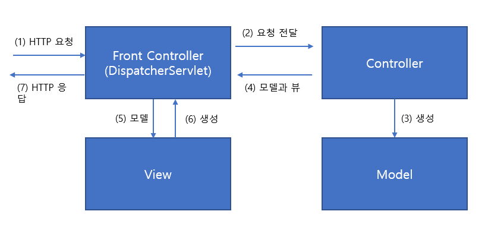

# 스프링 웹 기술과 MVC

- 스프링 서블릿/스프링 MVC는 스프링이 직접 제공하는 서블릿 기반의 MVC 프레임워크다. 애노테이션 설정과 유연한 핸들러 메소드를 지원하는 스프링 @MVC가 가장 대표적으로 사용되는 스프링 서블릿 기반의 기술이다.

- 스프링 MVC는 유연한 아키텍쳐를 가지고 장기적으로 많은 인원이 큰 규모의 시스템을 개발할 때 적합한 프레임워크다.

- MVC 아키텍쳐는 보통 `프론트 컨트롤러 패턴`과 함께 사용되며, Spring MVC에서는 `DispatcherServlet`이 프론트 컨트롤러 역할을 수행한다.

## DispatcherServlet 동작 과정 (매우 중요!)



### (1) DispatcherServlet에게 요청 전달

- 서블릿 컨테이너는 HTTP 요청이 DispatcherServlet이 처리하는 URL 패턴이라면 `DispatcherServlet에게 요청을 전달`한다.
- DispatcherServlet은 모든 요청에 대해 `공통적으로 수행해야 하는 전처리 작업`이 등록되어있다면 이를 먼저 수행한다. (예를 들면, 보안, 파라미터 조작, 한글인코딩 등..)

<br>

### (2) Controller에게 요청 전달

- DispatcherServlet이 어떤 Controller를 사용할 지에 대한 전략은 `핸들러 매핑 전략`을 통해서 이루어진다. 즉, 어떤 URL로 들어온 경우 어떤 컨트롤러를 사용할 지 결정한다.

- 컨트롤러의 사용법은 컨트롤러마다 다르므로 DispatcherServlet이 직접 사용이 불가능하다. 따라서 DispatcherServlet은 컨트롤러에 맞는 어댑터를 사용한다. DispatcherServlet이 핸들러 어댑터에 웹 요청을 전달할 때는 모든 웹 요청 정보가 담긴 HttpServletRequest 타입의 오브젝트를 전달해준다. 이를 어댑터가 적절히 변환해서 컨트롤러의 메소드가 받을 수 있는 파라미터로 변환해서 전달해주는 것이다.

**예시 코드**

```java
@Controller
public class HelloController{
    @RequestMapping("/hello")
    public String hello(@RequestParam("name") String name, Modelmap map){
        map.put("message", "Hello "+ name);
        return "/WEB-INF/view/hello.jsp";
    }
}
```

- `DefaultAnnotationHandlerMappping`은 `/hello` URL로 들어온 요청에 대해서는 해당 컨트롤러의 hello() 메소드를 호출해야 한다고 파악한다.
- `@Controller` 방식으로 구현된 컨트롤러는 DispatcherServlet이 `AnnotationMethodHandlerAdapter`라는 어댑터에게 `HttpServletRequest`를 넘겨준다. 어댑터는 그 정보를 가공하여 `hello`라는 메소드의 인자를 채워 호출한다.

<br>

### (3) 컨트롤러의 모델 생성과 정보 등록

- 컨트롤러의 작업은 `사용자 요청 해석`, `서비스 계층에게 작업 위임`, `결과를 받아서 모델 생성`, `어떤 뷰를 사용할 지 결정` 이렇게 네 가지로 분류할 수 있다.

- 컨트롤러는 어떤 식으로든 다시 DispatcherServlet에 돌려줘야 할 두 가지 정보가 있는데, 그중 하나가 모델이고 다른 하나는 뷰다. 모델은 키-밸류 형식의 데이터라고 생각하면 된다.

**예시코드**

```java
public String hello(@RequestParam("name") String name, Modelmap map){
    map.put("message", "Hello "+ name);
```

- 이 과정이 모델에 데이터를 채우는 모습이다.

<br>

### (4) 컨트롤러의 결과 리턴 : 모델과 뷰

- 컨트롤러가 뷰 오브젝트를 직접 리턴할 수도 있지만, `보통은 뷰의 논리적인 이름을 리턴`해주면 DispatcherServlet의 전략인 `뷰 리졸버`가 이를 이용해 뷰 오브젝트를 생성해준다.

- 스프링에는 `ModelAndView`라는 오브젝트가 있는데, 이 객체가 DispatcherServlet이 최종적으로 어댑터로부터 돌려받는 오브젝트다.

**예시코드**

```java
@RequestMapping("/hello")
public String hello(@RequestParam("name") String name, Modelmap map){
    map.put("message", "Hello "+ name);
    return "/WEB-INF/view/hello.jsp";
}
```

- 컨트롤러는 `"/WEB-INF/view/hello.jsp"`라는 뷰의 논리적 이름을 리턴하고 있다. default로 지정되어있는 `InternalResourceViewResolver`가 뷰 이름으로부터 뷰 객체를 생성한다. (뷰 객체는 뷰 페이지와 다르다!!)
- `InternalResourceViewResolver`는 빈으로 등록되어있고, `prefix=/WEB-INF/view/`와 `suffix=.jsp`를 정의해서 사용하는 것이 일반적이다.

<br>

### (5) DispatcherServlet의 뷰 호출, (6) 뷰 페이지 생성 (뷰의 모델 참조)

- DispatcherSerlvet은 `Model`을 `View`에게 전달하여 클라이언트에게 돌려줄 최종 결과물을 생성해달라고 요청한다.
- 동적으로 생성되도록 표시된 부분은 모델의 내용을 참고로 해서 내용을 채워준다.

  - `<div>이름 : ${name} </div>`

- View는 종류가 다양해서 `JSON`, `PDF` 등 View page의 미디어 타입에 따라 다른 뷰 리졸버를 사용해야 한다.

**View 코드**

```java
public interface View {
    String getContentType();

    void render(Map<String,?> model, HttpServletRequest request, HttpServletResponse response) throws Exception;
}
```

- `getContentType()`은 뷰 오브젝트가 생성하는 콘텐트 타입 정보를 제공해준다.
- `render()`는 모델을 전달받아 클라이언트에게 돌려줄 결과물을 생성한다.

<br>

### (7) HTTP 응답

- 뷰 페이지 생성까지의 작업을 모두 마쳤으면 DispatcherServlet은 후처리기가 있는지 확인하고, 뷰가 만들어준 **HttpServletResponse에 담긴 최종 결과를 서블릿 컨테이너에게 돌려준다.**

- 서블릿 컨테이너는 HttpServletResponse에 담긴 정보를 HTTP 응답으로 만들어 사용자의 브라우저나 클라이언트에게 전송하고 작업을 종료한다.

<br><hr>

## 컨트롤러의 종류와 핸들러 어댑터

- 스프링 MVC가 제공하는 컨트롤러의 종류는 네 가지이고 그에 따른 핸들러 어댑터도 네 가지이다.

- 다시 한번 말하지만, 핸들러 어댑터는 DispatcherServlet이 Controller를 호출하기 위해 사용하는 객체이다.

### Servlet과 SimpleServletHandlerAdapter

- 첫 번째 컨트롤러 타입은 표준 서블릿이다. 즉, javax.servlet.Servlet을 구현한 서블릿 클래스를 스프링 MVC의 컨트롤러로 사용할 수 있다. 단, 서블릿이 컨트롤러 빈으로 등록되는 경우, init(), destroy()와 같은 생명주기 메소드가 호출되지 않는다는 점을 주의하자.

<br>

### HttpRequestHandler와 HttpRequestHandlerAdapter

```java
public interface HttpRequestHandler{
    void handleRequest(HttpServletRequest request, HttpServletResponse response) throws ServletException, IOException;
}
```

- 이 객체를 구현한 클래스를 컨트롤러로 사용한다. 서블릿처럼 동작하는 컨트롤러를 만들기 위해 사용한다. 전형적인 서블릿 스펙을 준수할 필요없이 HTTP 프로토콜을 기반으로 한 전용 서비스를 만들려고 할 때 사용할 수 있다.

- 모델과 뷰 개념이 없는 HTTP 기반의 `RMI(Remote Method Invocation: 원격 메소드 호출)`과 같은 로우레벨 서비스를 개발할 때 사용할 수 있다.

<br>

### Controller와 SimpleControllerHandlerAdapter

```java
public interface Controller{
    ModelAndView handleRequest(HttpServletRequest request, HttpServletResponse response) throws Exception;
}
```

- 스프링 MVC의 대표적인 컨트롤러 타입이다.

- Controller를 직접 구현하는 것은 권장방법이 아니며, 필수 기능이 구현되어있는 AbstractController를 상속해서 컨트롤러를 구현하는 것이 좋다.

<br>

### @Controller와 AnnotationMethodHandlerAdapter

- 스프링 MVC에서 가장 인기 있는 컨트롤러 작성 방법이다.

- `AnnotationMethodHandlerAdapter`는 지원하는 컨트롤러의 타입에 제한이 없다는 특징이 있다. 대신 클래스에 붙은 몇가지 애노테이션의 정보와 메소드 이름, 파라미터, 리턴 타입에 대한 규칙 등을 종하바여 컨트롤러를 선별하고 호출하는 방식을 결정한다.

- `AnnotationMethodHandlerAdapter`의 또다른 특징은 URL 매핑을 컨트롤러 단위가 아니라 `메소드 단위`로 가능하게 했다. 그래서 Adapter의 이름에도 Method가 붙어있다.

- `AnnotationMethodHandler`는 `DefaultAnnotationHandlerMapping` 이라는 핸들러 매핑과 반드시 함께 사용해야 한다. 두 가지 모두 동일한 애노테이션을 사용하기 때문이다. 둘 다 디폴트로 설정되어있는 전략이므로 별도의 설정은 필요하지 않다.

```java
@Controller
public class HelloController{
    @RequestMapping("/hello")
    public String hello(@RequestParam("name") String name, Modelmap map){
        map.put("message", "Hello "+ name);
        return "/WEB-INF/view/hello.jsp";
    }
}
```

<br><hr>

## 핸들러 매핑

- 핸들러 매핑은 HTTP 정보를 이용해서 이를 처리할 `컨트롤러를 찾아주는 기능`을 가진 DispatcherServlet의 전략이다.

- 핸들러 매핑은 기본적으로 다섯 가지의 전략을 제공한다. 디폴트로 정의된 핸들러 매핑은 `BeanNameUrlHandlerMapping`, `DefaultAnnotationHandlerMapping`이다.

### BeanNameUrlHandlerMapping

```xml
<bean name="/s* class="springbook...Controller">
```

- HTTP 요청의 URL과 `빈의 이름`이 일치하는 빈을 찾아준다. "/s"로 시작하는 URL에 매핑된다.

- 컨트롤러의 개수가 많아지면 URL 정보가 분산되어 나타나므로 복잡한 애플리케이션에 적합하지 않다.

<br>

### ControllerBeanNameHandlerMapping

```java
@Component("hello")
```

- HTTP 요청의 URL과 `빈의 아이디`가 일치하는 빈을 찾아준다. "/hello"로 URL 요청이 왔을 때 해당 컨트롤러를 매핑한다. 이 전략은 prefix와 suffix를 지정해서 사용할 수도 있다.

- `ControllerBeanNameHandlerMapping`은 디폴트 핸들러 매핑이 아니므로 전략 빈으로 등록해주어야 한다.

<br>

### ControllerClassNameHandlerMapping

```java
public class HelloController implements Controller{ ... }
```

- 빈 이름 대신 `클래스 이름`을 URL에 매핑해주는 핸들러 매핑 클래스다. 만약 클래스 이름이 Controller로 끝날 경우에는 Controller를 뺀 나머지 이름을 URL에 매핑한다.

- 디폴트 전략이 아니므로 빈으로 등록해주어야 사용이 가능하다.

<br>

### SimpleUrlHandlerMapping

- `BeanNameUrlHandlerMapping`은 매핑 정보를 관리하기 불편하다는 단점이 있는데, 이를 극복하기 위해 매핑 정보를 한 곳에 모아놓을 수 있도록 해주는 핸들러 매핑 전략이다.

<br>

### DefaultAnnotationHandlerMapping

- 위에서도 언급했듯, 가장 인기있고 권장되는 핸들러 매핑 방식이다.
- `@RequestMapping`이라는 애노테이션을 컨트롤러 클래스나 메소드에 직접 부여하고 이를 이용해 매핑하는 전략이다.
- `@RequestMapping`은 메소드 단위로 URL을 매핑할 수 있어서 컨트롤러의 개수를 획기적으로 줄일 수 있는 장점이 있다.
- URL뿐 아니라, `GET/POST`와 같은 HTTP 메소드, 심지어는 `파라미터`와 `HTTP 헤더정보`까지 매핑에 활용할 수 있다.

- 애노테이션의 사용 정책과 작성 기준을 잘 만들어두지 않으면, 매핑정보가 지저분해지고 관리가 힘들어질 수도 있다.

<br><hr>

## 핸들러 인터셉터

- 핸들러 매핑의 역할은 기본적으로 URL과 요청정보로부터 컨트롤러 빈을 찾아주는 것이다. 하지만 이 기능 외에도 핸들러 인터셉터를 적용해주는 기능이 있다.

- 핸들러 인터셉터는 컨트롤러를 호출하기 전과 후에 요청과 응답을 참조하거나 가공할 수 있는 일종의 필터다. (서블릿 필터와 유사)

- DispatcherServlet으로부터 매핑 작업을 요청받으면 그 결과로 `핸들러 실행 체인(HandlerExecutionChain)`을 돌려준다. 이 핸들러 실행 체인은 핸들러 인터셉터를 거쳐서 컨트롤러가 실행되도록 구성되어있다.

- 핸들러 인터셉터는 그 적용 대상이 DispatcherServlet의 특정 핸들러 매핑으로 제한된다는 제약이 있지만, 스프링의 빈으로 등록할 수 있고, 컨트롤러 오브젝트에 접근이 가능하며, ModelAndView와 같은 컨트롤러가 리턴하는 정보를 활용할 수 있다는 장점이 있다.

<br><hr>

## 뷰

- 뷰는 MVC 아키텍쳐에서 모델이 가진 정보를 어떻게 표현해야 하는지에 대한 로직을 갖고 있는 컴포넌트다.

- 컨트롤러가 작업을 마치고 정보를 ModelAndView 타입 오브젝트에 담아서 DispatcherServlet에 돌려주는 방법은 크게 두 가지다. 하나는 View 타입의 오브젝트를 돌려주는 방법이고, 다른 하나는 뷰 이름을 돌려주는 방법이다. 뷰 이름을 돌려주는 경우에는 실제 사용할 뷰를 결정해주는 뷰 리졸버가 필요하다.

<br>

## 뷰 오브젝트

- DispatcherServlet이 사용하는 뷰 오브젝트는 `View` 인터페이스를 구현해야 한다.
- 주요 기능으로는 getContentType()과 render()가 있다.

### InternalResourceView와 JstlView

- InternalResourceView는 RequestDispatcher의 forward()나 include()를 이용하는 뷰다. 주로 JSP 서블릿을 통해 JSP 뷰를 적용할 때 사용한다.

- 컨트롤러가 돌려준 뷰 이름을 포워딩할 JSP의 이름으로 사용하고 모델 정보를 요청 애트리뷰트에 넣어주는 작업을 InternalResourceView가 진행한다.

- JstlView은 InternalResourceView의 서브 클래스다. JstlView는 지역정보에 따라 달라지는 지역화된 메시지를 JSP 뷰에 사용할 수 있게 해준다.

```java
return new ModelAndView("/WEB-INF/view/hello.jsp", model);
```

<br>

### RedirectView

- HttpServletResponse의 sendRedirect()를 호출해주는 기능을 가진 뷰다.

- RedirectView를 직접 만들어서 리턴해도 되지만, 뷰 리졸버가 인식할 수 있도록 `redirect:`로 시작하는 뷰 이름을 사용하는 것이 편리하다.

```java
return new ModelAndView("redirect:/main");
```

<br>

### VelocityView, FreeMarkerView

- 벨로서티와 프리마커 뷰의 장점은 JSP에 비해 문법이 훨씬 강력하고 속도가 빠른 템플릿 엔진을 사용할 수 있다는 것이다.

- JSP는 JSP 서블릿을 구동시켜야 하므로 단위 테스트가 어렵다.

<br>

### MappingJacksonJsonView

- Ajax에서 많이 사용되는 JSON 타입의 콘텐트를 작성해주는 뷰다. 기본적으로 모델의 모든 오브젝트를 JSON으로 변환해준다.

<br>

### 그 외

- applilcation/xml 타입의 XML 콘텐트를 작성하게 해주는 `MarshallingView`
- 엑셀과 PDF를 만들어주는 `AbstarctExcelView`, `AbstractJExcelView`, `AbstractPdfView`
- application/atom+xml 타입의 피드 문서를 생성해주는 `AbstractAtomFeedView`
- application/rss+xml 타입의 피드 문서를 생성해주는 `AbstractRssFeedView`

등이 있다.

<br><hr>

## 뷰 리졸버

- 뷰 리졸버는 핸들러 매핑이 URL로부터 컨트롤러를 찾아주는 것처럼, 뷰 이름으로부터 사용할 뷰 오브젝트를 찾아준다.
- 뷰 리졸버는 ViewResolver 인터페이스를 구현해서 만들어지며, 디폴트로는 `InternalViewResolver`가 사용된다.

### InternalViewResolver

- 디폴트로 등록되는 뷰 리졸버로 주로 JSP를 뷰로 사용하고자 할 때 쓰인다.
- properties로 `prefix`, `suffix`를 지정해 포워딩 할 뷰 이름을 축약할 수 있다.
- 컨트롤러가 뷰의 이름을 넘겨주지 않았을 경우, `RequestToViewNameTranslator`가 URL을 이용해 자동으로 뷰 이름을 만들어준다.
  - ex) URL이 "/admin/member.do" 라면 "admin/member"를 논리적인 뷰 이름으로 지정한다.

<br>

### VelocityViewResolver, FreeMarkerViewResolver

- 템플릿 엔진 기반의 뷰인 VelocityView와 FreeMarkerView를 사용하게 해주는 뷰 리졸버다.

<br>

### ContentNegotiatingViewResolver

- 미디어 타입 정보를 활용해서 다른 뷰 리졸버에게 뷰를 찾도록 위임한 후에 가장 적절한 뷰를 선정해서 돌려준다. 뷰 리졸버를 결정하는 뷰 리졸버라고 볼 수도 있다.

- Spring 3.0에서 새로 추가된 뷰 리졸버다.

#### 미디어 타입 결정

`ContentNegotiatingViewResolver`가 미디어 타입을 결정하는 방법은 총 네 가지가 있다.

1. URL의 확장자 타입을 이용한다. ex) /hello.json
2. 포맷 파라미터를 확인한다. ex) /hello?format=pdf
3. HTTP Accept 헤더를 확인한다.
4. defaultContentType 프로퍼티에서 설정해준 디폴트 미디어 타입을 사용한다.

#### 최종 뷰 선정

- 미디어 타입이 결정됐다면, 모든 뷰 리졸버에게 보내서 적용 가능한 뷰 후보를 찾는다. 이때 뷰 리졸버 간의 우선순위는 무시한다.
- 요청정보에서 가져온 미디어 타입과 뷰 리졸버에서 찾은 후보 뷰 목록을 매칭해서 사용할 뷰를 결정한다.
- 예를 들어 HTML, PDF, Excel 미디어 타입의 뷰 후보를 얻었다고 했을 때, 이 중에서 요청정보에서 추출한 미디어 타입과 일치하는 것이 최종적으로 사용할 뷰가 된다. ex) /hello.html 이었으면 HTML 미디어 타입의 뷰를 선택한다는 뜻.

<br><hr>

## 핸들러 예외 리졸버

- `HandlerExceptionResolver`는 컨트롤러의 작업 중에 발생한 예외를 어떻게 처리할지 결정하는 전략이다.
- 컨트롤러나 그 뒤의 계층에서 던져진 예외는 DispatcherServlet이 일단 전달받은 뒤에 다시 서블릿 밖으로 던져서 서블릿 컨테이너가 처리하게 된다. 하지만 핸들러 예외 리졸버가 등록되어있다면 DispatcherServlet은 먼저 핸들러 예외 리졸버에게 해당 예외를 처리할 수 있는지 확인한다.

### AnnotationMethodHandlerExceptionResolver

- 예외가 발생한 컨트롤러 내의 메소드 중에서 @ExceptionHandler 애노테이션이 붙은 메소드를 찾아 예외처리를 맡겨주는 디폴트 핸들러 예외 리졸버이다.

**예시 코드**

```java
@Controller
public class HelloCon{
    @ExceptionHandler(DataAccessException.class)
    public ModelAndView dataAccessExceptionHandler(DataAccessException ex){
        return new ModelAndView("dataexception").addObject("msg", ex.getMessge());
    }
}
```

<br>

### ResponseStatusExceptionResolver

- 예외를 특정 HTTP 응답 상태 코드로 전환해주는 디폴트 핸들러 예외 리졸버이다.

<br>

### DefaultHandlerExceptionResolver

- 위의 두 가지 예외 리졸버에서 처리하지 못한 예외를 다루는 리졸버이다.
- 스프링에서 내부적으로 발생하는 주요 예외를 처리해주는 표준 예외처리 로직을 담고 있다.
